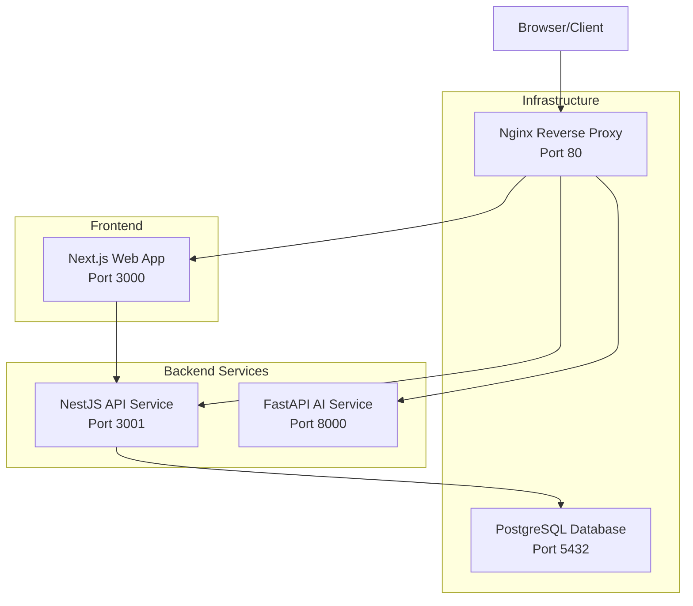
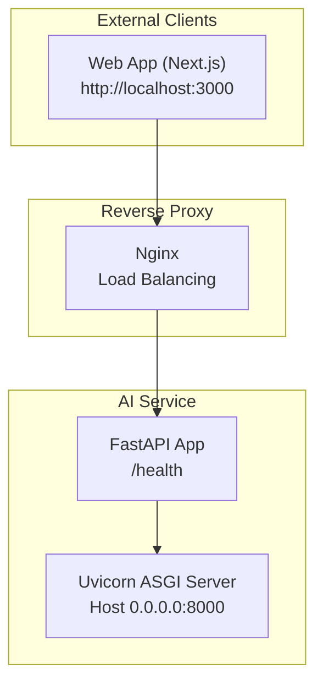
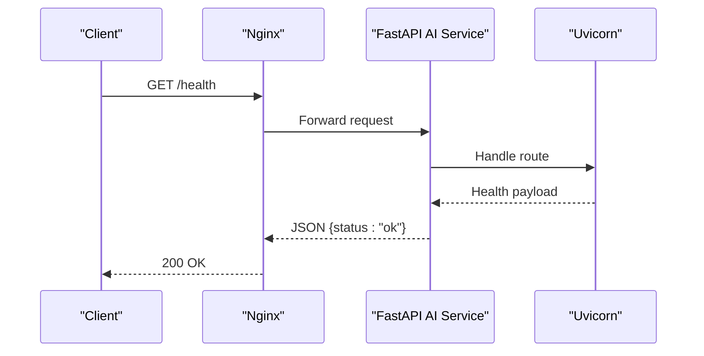
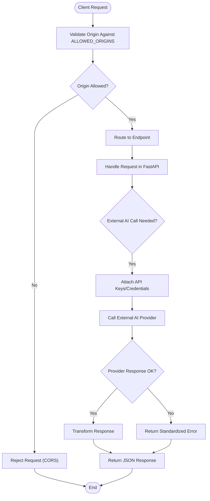
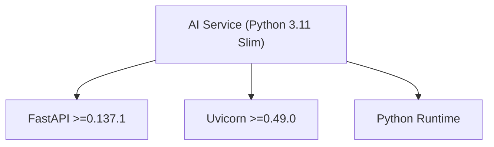

# AI Integration

<cite>
**Referenced Files in This Document**
- [main.py](file://apps/ai-service/main.py)
- [Dockerfile](file://apps/ai-service/Dockerfile)
- [pyproject.toml](file://apps/ai-service/pyproject.toml)
- [requirements.txt](file://apps/ai-service/requirements.txt)
- [uv.lock](file://apps/ai-service/uv.lock)
- [docker-compose.yaml](file://docker-compose.yaml)
- [api-client.ts](file://apps/web/lib/api-client.ts)
- [page.tsx](file://apps/web/app/(dashboard)/ai-assistant/page.tsx)
- [ci-cd.yaml](file://.github/workflows/ci-cd.yaml)
- [README.md](file://README.md)
- [SECURITY.md](file://SECURITY.md)
- [.env.example](file://apps/ai-service/.env.example)
- [.env.example](file://apps/web/.env.example)
</cite>

## Table of Contents
1. [Introduction](#introduction)
2. [Project Structure](#project-structure)
3. [Core Components](#core-components)
4. [Architecture Overview](#architecture-overview)
5. [Detailed Component Analysis](#detailed-component-analysis)
6. [Dependency Analysis](#dependency-analysis)
7. [Performance Considerations](#performance-considerations)
8. [Troubleshooting Guide](#troubleshooting-guide)
9. [Conclusion](#conclusion)
10. [Appendices](#appendices)

## Introduction
This document provides comprehensive AI integration documentation for the FastAPI-based AI service within a multi-service architecture. It covers the AI service endpoints, request/response patterns, integration with external AI models, error handling, performance optimization, deployment configuration, scaling considerations, and monitoring approaches. The AI service is designed to be lightweight, containerized, and integrated behind a reverse proxy with CORS restrictions for secure cross-origin access.

## Project Structure
The AI service resides under apps/ai-service and is orchestrated alongside the API backend, web frontend, and supporting infrastructure (PostgreSQL, Nginx) using Docker Compose. The web application currently simulates AI responses locally; the AI service endpoint is prepared for future integration with external AI providers.

**Diagram sources**
- [docker-compose.yaml:1-83](file://docker-compose.yaml#L1-L83)
- [main.py:1-30](file://apps/ai-service/main.py#L1-L30)

**Section sources**
- [docker-compose.yaml:1-83](file://docker-compose.yaml#L1-L83)
- [README.md:1-65](file://README.md#L1-L65)

## Core Components
- FastAPI AI Service: Provides health check endpoint and CORS-enabled HTTP server.
- Containerization: Lightweight Python 3.11 Slim base image with uv for fast dependency installation.
- Orchestration: Docker Compose defines service dependencies, port mappings, and environment variables.
- Frontend Integration Point: Next.js client configured to communicate with backend APIs; AI service endpoint is reserved for external model integration.

Key implementation references:
- AI service entrypoint and CORS configuration: [main.py:1-30](file://apps/ai-service/main.py#L1-L30)
- Container build and runtime: [Dockerfile:1-24](file://apps/ai-service/Dockerfile#L1-L24)
- Project metadata and dependencies: [pyproject.toml:1-11](file://apps/ai-service/pyproject.toml#L1-L11), [requirements.txt:1-3](file://apps/ai-service/requirements.txt#L1-L3), [uv.lock:1-242](file://apps/ai-service/uv.lock#L1-L242)
- Orchestration and environment variables: [docker-compose.yaml:41-53](file://docker-compose.yaml#L41-L53)

**Section sources**
- [main.py:1-30](file://apps/ai-service/main.py#L1-L30)
- [Dockerfile:1-24](file://apps/ai-service/Dockerfile#L1-L24)
- [pyproject.toml:1-11](file://apps/ai-service/pyproject.toml#L1-L11)
- [requirements.txt:1-3](file://apps/ai-service/requirements.txt#L1-L3)
- [uv.lock:1-242](file://apps/ai-service/uv.lock#L1-L242)
- [docker-compose.yaml:41-53](file://docker-compose.yaml#L41-L53)

## Architecture Overview
The AI service follows a microservice pattern:
- Stateless FastAPI application exposing a minimal health endpoint.
- CORS middleware configured via environment variable ALLOWED_ORIGINS.
- Containerized with uv for efficient dependency resolution.
- Integrated behind Nginx with the web app and API service.

**Diagram sources**
- [main.py:7-30](file://apps/ai-service/main.py#L7-L30)
- [Dockerfile:20-24](file://apps/ai-service/Dockerfile#L20-L24)
- [docker-compose.yaml:70-80](file://docker-compose.yaml#L70-L80)

**Section sources**
- [main.py:7-30](file://apps/ai-service/main.py#L7-L30)
- [Dockerfile:20-24](file://apps/ai-service/Dockerfile#L20-L24)
- [docker-compose.yaml:70-80](file://docker-compose.yaml#L70-L80)

## Detailed Component Analysis

### AI Service Endpoints and Data Flow
Current endpoints:
- GET /health: Returns service health status.
- HEAD /: Returns empty plaintext response.

Endpoints are defined in the FastAPI application and exposed via Uvicorn.

**Diagram sources**
- [main.py:24-26](file://apps/ai-service/main.py#L24-L26)
- [Dockerfile:22-24](file://apps/ai-service/Dockerfile#L22-L24)

**Section sources**
- [main.py:24-30](file://apps/ai-service/main.py#L24-L30)

### AI Model Integration Patterns
The AI service is currently a minimal FastAPI server. To integrate external AI models:
- Define new routes under the FastAPI app for inference requests.
- Accept structured payloads (e.g., prompt text, context, model parameters).
- Invoke external AI provider SDKs or REST endpoints with appropriate authentication.
- Stream or batch-process responses and return standardized JSON.
- Apply request validation and error handling aligned with the project’s error model.

Note: The frontend currently simulates AI responses locally. The AI service endpoint is reserved for future integration with external providers.

**Section sources**
- [page.tsx](file://apps/web/app/(dashboard)/ai-assistant/page.tsx#L74-L81)

### Request/Response Formats
- Health endpoint: GET /health returns a JSON object with a status field.
- Root HEAD endpoint: HEAD / returns an empty plaintext response.

These formats are defined in the FastAPI application.

**Section sources**
- [main.py:24-30](file://apps/ai-service/main.py#L24-L30)

### External API Communication
- Environment-driven CORS: ALLOWED_ORIGINS controls permitted origins for cross-origin requests.
- AI service environment variables: API_KEY_EXTERNAL for external provider keys.
- Frontend client configuration: NEXT_PUBLIC_API_URL directs API calls to the backend.

**Diagram sources**
- [main.py:12-21](file://apps/ai-service/main.py#L12-L21)
- [docker-compose.yaml:50-52](file://docker-compose.yaml#L50-L52)
- [.env.example:1-3](file://apps/ai-service/.env.example#L1-L3)

**Section sources**
- [main.py:12-21](file://apps/ai-service/main.py#L12-L21)
- [docker-compose.yaml:50-52](file://docker-compose.yaml#L50-L52)
- [.env.example:1-3](file://apps/ai-service/.env.example#L1-L3)

### Error Handling
- CORS misconfiguration is prevented by restricting origins via environment variables.
- Standardized error responses and HTTP status codes are used consistently across the stack (referenced in shared packages).
- For the AI service, implement centralized exception handling to return consistent JSON errors with success=false, message, code, and optional details.

**Section sources**
- [main.py:12-21](file://apps/ai-service/main.py#L12-L21)
- [SECURITY.md:36-42](file://SECURITY.md#L36-L42)

### Performance Optimization
- Container startup: uv is used for fast dependency installation in the Python slim image.
- Runtime: Uvicorn serves the FastAPI app efficiently.
- Recommendations:
  - Use connection pooling for external AI provider calls.
  - Implement request/response timeouts and circuit breakers.
  - Add caching for repeated prompts and static responses.
  - Scale horizontally with multiple replicas behind Nginx.
  - Monitor latency and throughput metrics.

**Section sources**
- [Dockerfile:1-24](file://apps/ai-service/Dockerfile#L1-L24)
- [uv.lock:1-242](file://apps/ai-service/uv.lock#L1-L242)

## Dependency Analysis
The AI service relies on FastAPI and Uvicorn. Dependencies are managed via uv and pinned in uv.lock.

**Diagram sources**
- [pyproject.toml:7-10](file://apps/ai-service/pyproject.toml#L7-L10)
- [uv.lock:14-18](file://apps/ai-service/uv.lock#L14-L18)

**Section sources**
- [pyproject.toml:7-10](file://apps/ai-service/pyproject.toml#L7-L10)
- [uv.lock:14-18](file://apps/ai-service/uv.lock#L14-L18)

## Performance Considerations
- Container image: python:3.11-slim-bookworm reduces footprint.
- Dependency installation: uv pip install --system accelerates setup.
- Runtime: Uvicorn ASGI server optimized for async workloads.
- Scaling: Horizontal scaling supported via Docker Compose; place multiple replicas behind Nginx.
- Observability: Add Prometheus metrics and logs for latency, error rates, and throughput.

[No sources needed since this section provides general guidance]

## Troubleshooting Guide
Common issues and resolutions:
- CORS errors: Ensure ALLOWED_ORIGINS includes the frontend origin(s).
- Health check failures: Verify service is reachable on port 8000 and Nginx routing is configured.
- Environment variables: Confirm API_KEY_EXTERNAL and ALLOWED_ORIGINS are set appropriately.
- Container startup: Check uv.lock compatibility and Dockerfile build steps.

**Section sources**
- [main.py:12-21](file://apps/ai-service/main.py#L12-L21)
- [docker-compose.yaml:50-52](file://docker-compose.yaml#L50-L52)
- [.env.example:1-3](file://apps/ai-service/.env.example#L1-L3)

## Conclusion
The AI service provides a secure, containerized foundation for integrating external AI models. Its minimal FastAPI surface, enforced CORS, and streamlined containerization support scalable deployment behind Nginx. Future enhancements should focus on standardized request/response formats, robust error handling, and observability to support production-grade AI inference.

[No sources needed since this section summarizes without analyzing specific files]

## Appendices

### Deployment Configuration
- Build and run with Docker Compose; services expose ports 3000 (web), 3001 (API), 5432 (DB), 8000 (AI), and 80 (Nginx).
- Environment variables for AI service include API_KEY_EXTERNAL and ALLOWED_ORIGINS.
- CI/CD pipeline installs Python dependencies and builds containers on push to main.

**Section sources**
- [docker-compose.yaml:41-53](file://docker-compose.yaml#L41-L53)
- [ci-cd.yaml:42-46](file://.github/workflows/ci-cd.yaml#L42-L46)
- [README.md:33-65](file://README.md#L33-L65)

### Monitoring Approaches
- Frontend monitoring: Track API latency and error rates from the Next.js client.
- Backend monitoring: Instrument FastAPI endpoints with metrics and structured logs.
- Infrastructure monitoring: Observe Nginx access logs, container resource usage, and database health.

[No sources needed since this section provides general guidance]