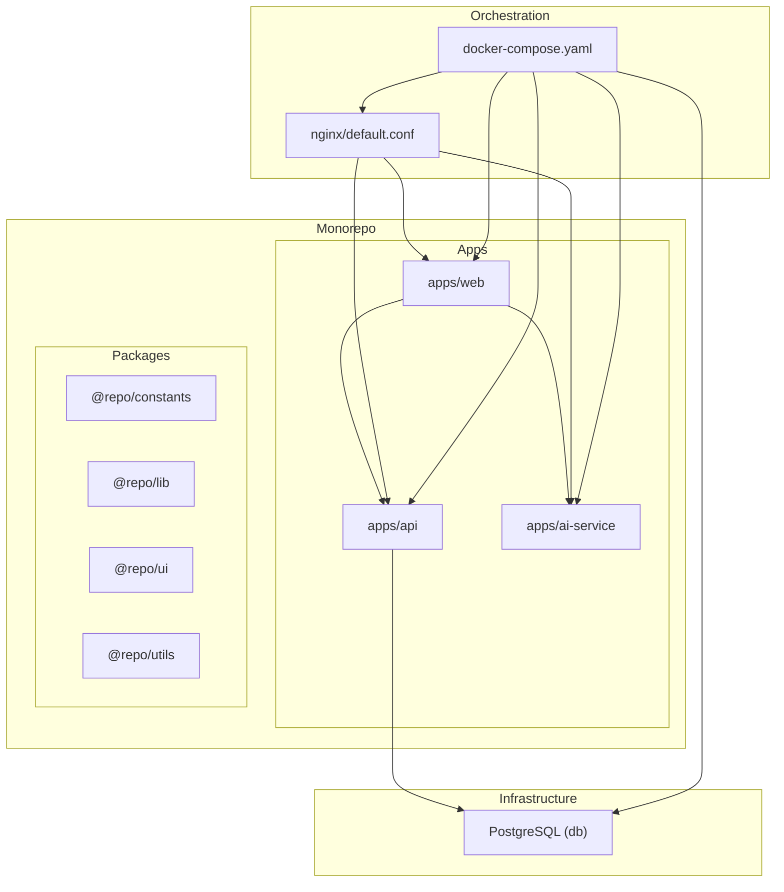
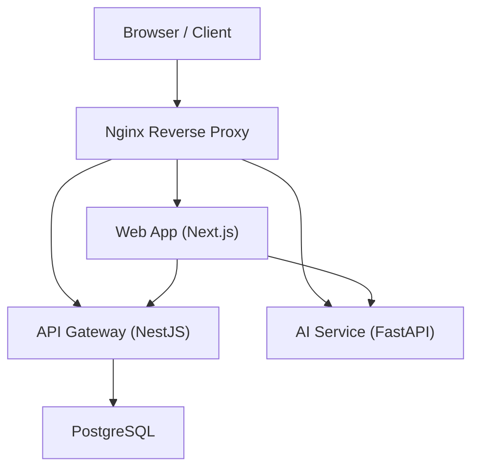
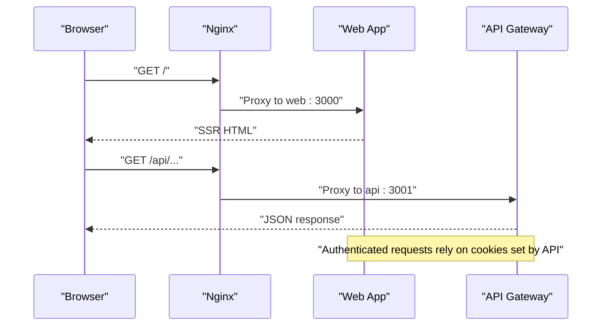
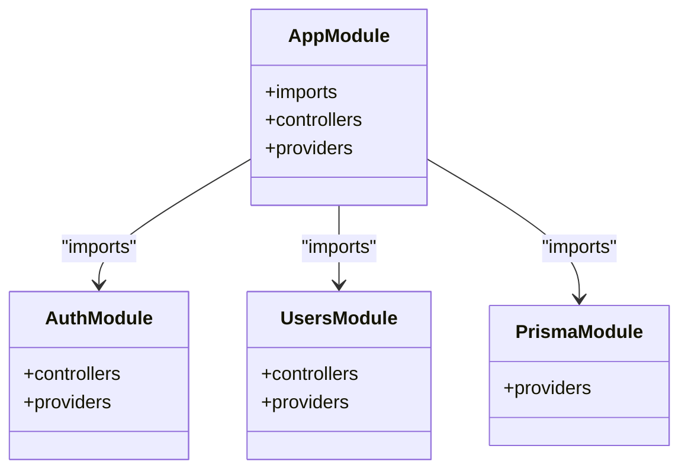
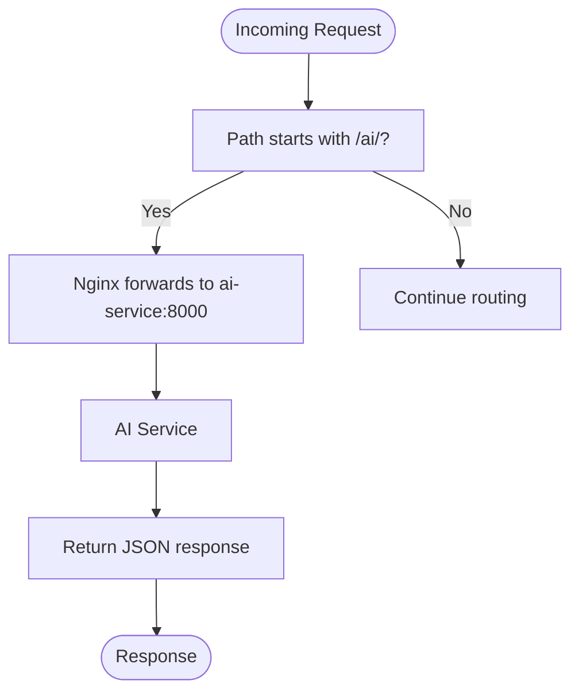
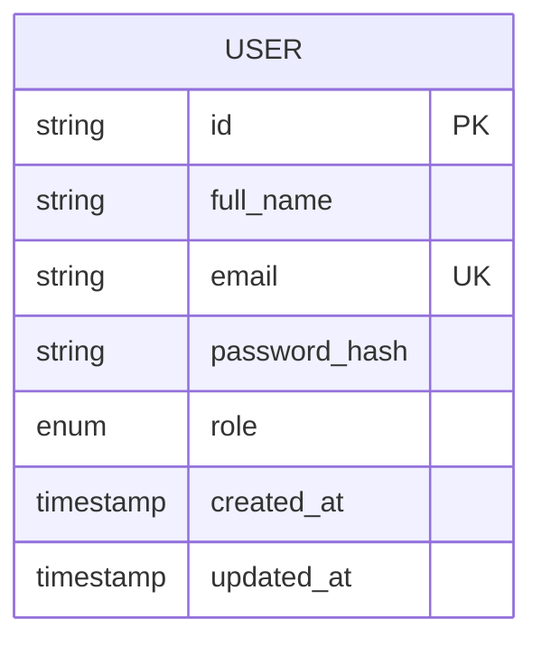
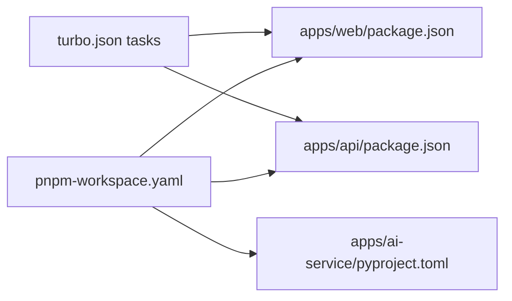

# Architecture & Design

<cite>
**Referenced Files in This Document**
- [docker-compose.yaml](file://docker-compose.yaml)
- [turbo.json](file://turbo.json)
- [pnpm-workspace.yaml](file://pnpm-workspace.yaml)
- [apps/api/src/main.ts](file://apps/api/src/main.ts)
- [apps/api/src/app.module.ts](file://apps/api/src/app.module.ts)
- [apps/api/src/modules/auth/auth.module.ts](file://apps/api/src/modules/auth/auth.module.ts)
- [apps/api/src/modules/users/users.module.ts](file://apps/api/src/modules/users/users.module.ts)
- [apps/api/prisma/schema.prisma](file://apps/api/prisma/schema.prisma)
- [apps/api/Dockerfile](file://apps/api/Dockerfile)
- [apps/web/middleware.ts](file://apps/web/middleware.ts)
- [apps/web/app/layout.tsx](file://apps/web/app/layout.tsx)
- [apps/web/lib/api-client.ts](file://apps/web/lib/api-client.ts)
- [apps/web/package.json](file://apps/web/package.json)
- [apps/ai-service/main.py](file://apps/ai-service/main.py)
- [nginx/default.conf](file://nginx/default.conf)
</cite>

## Table of Contents
1. [Introduction](#introduction)
2. [Project Structure](#project-structure)
3. [Core Components](#core-components)
4. [Architecture Overview](#architecture-overview)
5. [Detailed Component Analysis](#detailed-component-analysis)
6. [Dependency Analysis](#dependency-analysis)
7. [Performance Considerations](#performance-considerations)
8. [Troubleshooting Guide](#troubleshooting-guide)
9. [Conclusion](#conclusion)
10. [Appendices](#appendices)

## Introduction
AgriNexus is a microservices-based platform designed to support agricultural stakeholders with authentication, user management, data persistence, and AI-powered insights. The system follows a monorepo approach using Turborepo and pnpm workspaces, containerized with Docker, and orchestrated via Docker Compose. An Nginx reverse proxy routes traffic to the web application, API gateway, and AI service, while a shared PostgreSQL database persists user data.

## Project Structure
The repository is organized as a monorepo with:
- apps: Application services (web, API, AI service)
- packages: Shared libraries and UI components
- docker-compose.yaml: Orchestration of containers
- turbo.json and pnpm-workspace.yaml: Monorepo tooling and workspace configuration
- nginx/default.conf: Reverse proxy routing rules

**Diagram sources**
- [docker-compose.yaml](file://docker-compose.yaml)
- [pnpm-workspace.yaml](file://pnpm-workspace.yaml)
- [nginx/default.conf](file://nginx/default.conf)

**Section sources**
- [pnpm-workspace.yaml](file://pnpm-workspace.yaml)
- [turbo.json](file://turbo.json)
- [docker-compose.yaml](file://docker-compose.yaml)

## Core Components
- Web Application (Next.js): Provides the frontend UI, client-side routing, and integrates with the backend via a configured Axios client. It enforces session-based authentication using cookies and applies global middleware for route protection.
- API Gateway (NestJS): Serves as the backend entrypoint, offering authentication, user management, and Prisma-backed persistence. It exposes REST endpoints under a global prefix and Swagger documentation.
- AI Service (FastAPI): Offers lightweight AI-related endpoints behind a CORS-enabled interface, intended for AI-assisted features.
- Database (PostgreSQL): Persistent storage for user accounts and related metadata.
- Reverse Proxy (Nginx): Routes inbound traffic to the appropriate service based on path prefixes.

Key integration patterns:
- Cookie-based session authentication flows through the API and is validated by the web app’s middleware.
- The web app communicates with the API using a configured base URL and credentials.
- Nginx proxies requests to the web app, API, and AI service based on path segments.

**Section sources**
- [apps/web/middleware.ts](file://apps/web/middleware.ts)
- [apps/web/lib/api-client.ts](file://apps/web/lib/api-client.ts)
- [apps/api/src/main.ts](file://apps/api/src/main.ts)
- [apps/api/src/app.module.ts](file://apps/api/src/app.module.ts)
- [apps/api/prisma/schema.prisma](file://apps/api/prisma/schema.prisma)
- [apps/ai-service/main.py](file://apps/ai-service/main.py)
- [nginx/default.conf](file://nginx/default.conf)

## Architecture Overview
The system employs a layered architecture:
- Presentation Layer: Next.js web app
- API Layer: NestJS REST API with modules for auth and users
- Persistence Layer: Prisma ORM over PostgreSQL
- Intelligence Layer: AI service
- Infrastructure Layer: Docker Compose orchestration and Nginx proxy

**Diagram sources**
- [nginx/default.conf](file://nginx/default.conf)
- [apps/web/lib/api-client.ts](file://apps/web/lib/api-client.ts)
- [apps/api/src/main.ts](file://apps/api/src/main.ts)
- [apps/api/prisma/schema.prisma](file://apps/api/prisma/schema.prisma)
- [apps/ai-service/main.py](file://apps/ai-service/main.py)

## Detailed Component Analysis

### Web Application (Next.js)
Responsibilities:
- Client-side rendering and routing
- Global React Query provider for caching and state
- Middleware enforcing authentication and redirect logic
- HTTP client configured with credentials and base URL

**Diagram sources**
- [nginx/default.conf](file://nginx/default.conf)
- [apps/web/middleware.ts](file://apps/web/middleware.ts)
- [apps/web/lib/api-client.ts](file://apps/web/lib/api-client.ts)
- [apps/api/src/main.ts](file://apps/api/src/main.ts)

**Section sources**
- [apps/web/middleware.ts](file://apps/web/middleware.ts)
- [apps/web/app/layout.tsx](file://apps/web/app/layout.tsx)
- [apps/web/lib/api-client.ts](file://apps/web/lib/api-client.ts)
- [apps/web/package.json](file://apps/web/package.json)

### API Gateway (NestJS)
Responsibilities:
- Centralized REST API with global prefix and CORS
- Authentication module with JWT and Google OAuth strategies
- Users module for user CRUD operations
- Prisma integration for data access

**Diagram sources**
- [apps/api/src/app.module.ts](file://apps/api/src/app.module.ts)
- [apps/api/src/modules/auth/auth.module.ts](file://apps/api/src/modules/auth/auth.module.ts)
- [apps/api/src/modules/users/users.module.ts](file://apps/api/src/modules/users/users.module.ts)

**Section sources**
- [apps/api/src/main.ts](file://apps/api/src/main.ts)
- [apps/api/src/app.module.ts](file://apps/api/src/app.module.ts)
- [apps/api/src/modules/auth/auth.module.ts](file://apps/api/src/modules/auth/auth.module.ts)
- [apps/api/src/modules/users/users.module.ts](file://apps/api/src/modules/users/users.module.ts)
- [apps/api/prisma/schema.prisma](file://apps/api/prisma/schema.prisma)

### AI Service (FastAPI)
Responsibilities:
- Lightweight AI endpoints behind CORS configuration
- Health check endpoint for readiness probing

**Diagram sources**
- [nginx/default.conf](file://nginx/default.conf)
- [apps/ai-service/main.py](file://apps/ai-service/main.py)

**Section sources**
- [apps/ai-service/main.py](file://apps/ai-service/main.py)
- [nginx/default.conf](file://nginx/default.conf)

### Database (PostgreSQL)
Responsibilities:
- Persistent storage for user accounts and timestamps
- Schema defines user roles and mapped column names

**Diagram sources**
- [apps/api/prisma/schema.prisma](file://apps/api/prisma/schema.prisma)

**Section sources**
- [apps/api/prisma/schema.prisma](file://apps/api/prisma/schema.prisma)

## Dependency Analysis
Monorepo tooling and workspace:
- Turborepo orchestrates builds, linting, and type checking across apps and packages
- pnpm workspaces define cross-package dependencies and shared packages

**Diagram sources**
- [turbo.json](file://turbo.json)
- [pnpm-workspace.yaml](file://pnpm-workspace.yaml)
- [apps/web/package.json](file://apps/web/package.json)
- [apps/api/Dockerfile](file://apps/api/Dockerfile)

**Section sources**
- [turbo.json](file://turbo.json)
- [pnpm-workspace.yaml](file://pnpm-workspace.yaml)
- [apps/web/package.json](file://apps/web/package.json)
- [apps/api/Dockerfile](file://apps/api/Dockerfile)

## Performance Considerations
- Containerization: Multi-stage builds reduce runtime images and optimize layer caching.
- Caching: Turborepo caches task outputs to accelerate local development and CI.
- Reverse Proxy: Nginx handles connection upgrades and header forwarding efficiently.
- Database: Use connection pooling and Prisma client best practices for scalable queries.
- CORS: Configure allowed origins carefully to avoid preflight overhead.

[No sources needed since this section provides general guidance]

## Troubleshooting Guide
Common issues and resolutions:
- CORS errors between web and API: Verify ALLOWED_ORIGINS and credentials settings in both services.
- Authentication loops: Ensure cookies are set with proper SameSite and domain attributes and that the middleware redirects behave as expected.
- Database connectivity: Confirm DATABASE_URL format and network reachability inside Docker Compose.
- Health checks: Use Nginx locations and service health endpoints to validate service readiness.

**Section sources**
- [apps/api/src/main.ts](file://apps/api/src/main.ts)
- [apps/web/middleware.ts](file://apps/web/middleware.ts)
- [docker-compose.yaml](file://docker-compose.yaml)
- [nginx/default.conf](file://nginx/default.conf)

## Conclusion
AgriNexus leverages a clean separation of concerns across the web app, API gateway, AI service, and shared database, orchestrated by Docker Compose and routed by Nginx. The monorepo structure with Turborepo and pnpm enables efficient development and deployment workflows. The layered architecture supports scalability, maintainability, and clear service boundaries.

[No sources needed since this section summarizes without analyzing specific files]

## Appendices

### Deployment Topology
- Local development: Docker Compose brings up web, API, AI service, and database with Nginx as the ingress.
- Production: Replace Nginx with a production-grade load balancer and secure TLS termination; scale services horizontally as needed.

**Section sources**
- [docker-compose.yaml](file://docker-compose.yaml)
- [nginx/default.conf](file://nginx/default.conf)