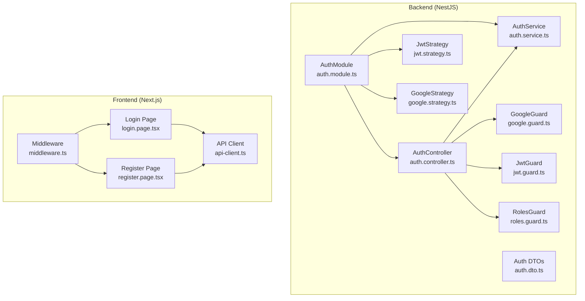
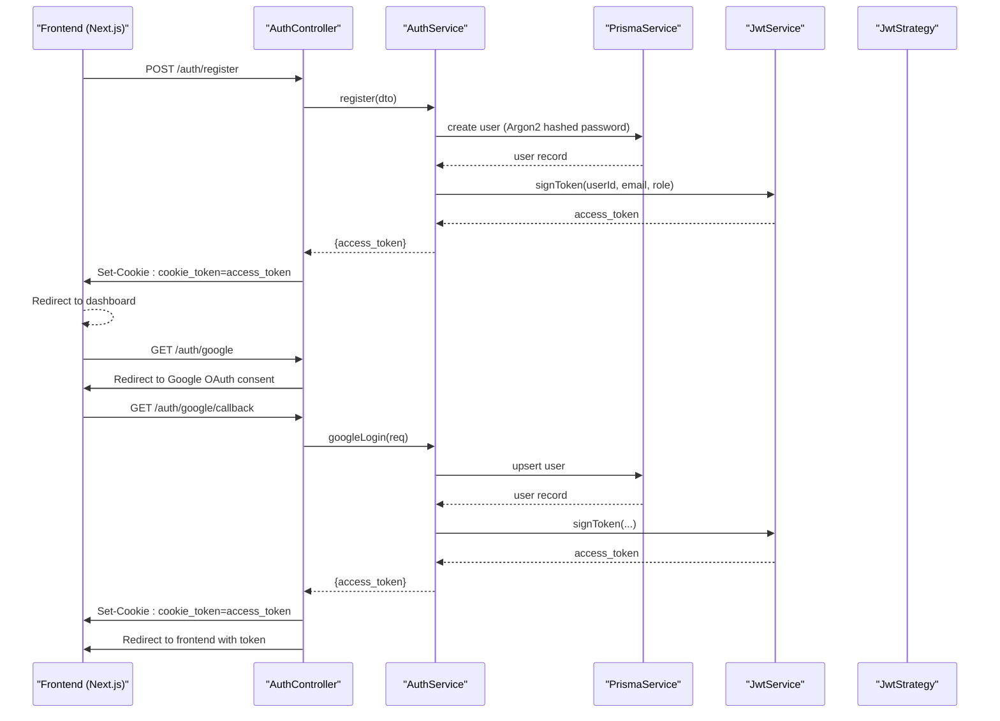
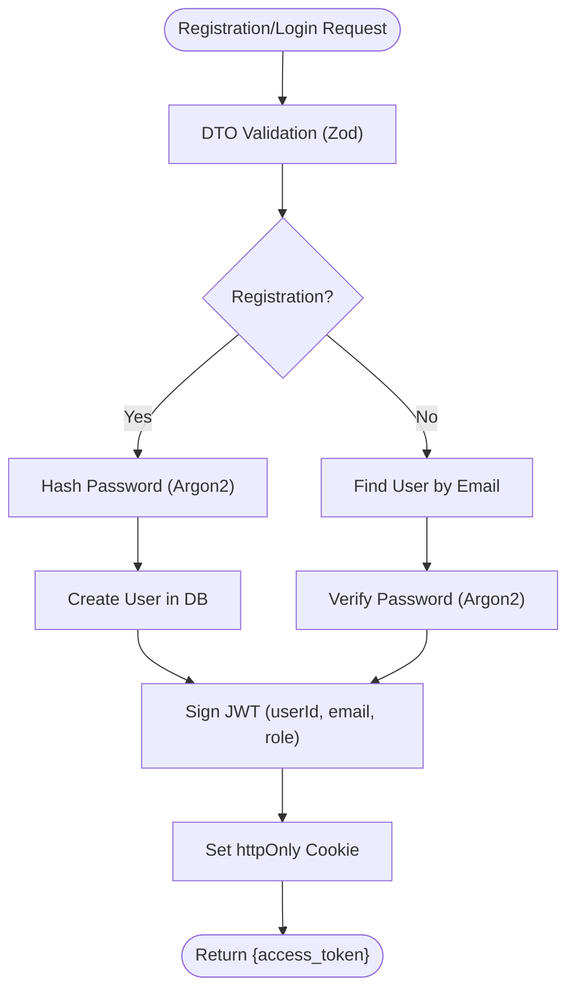
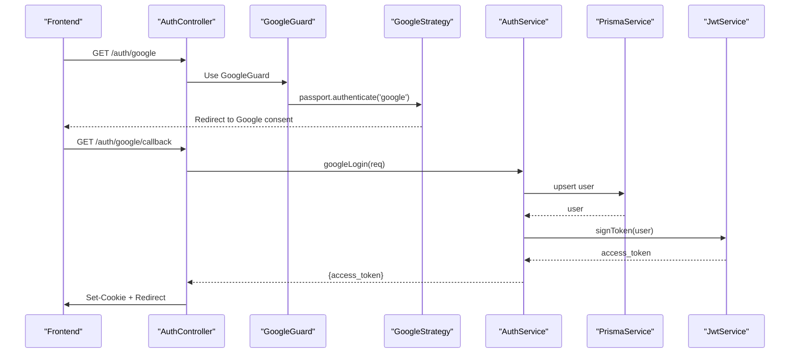
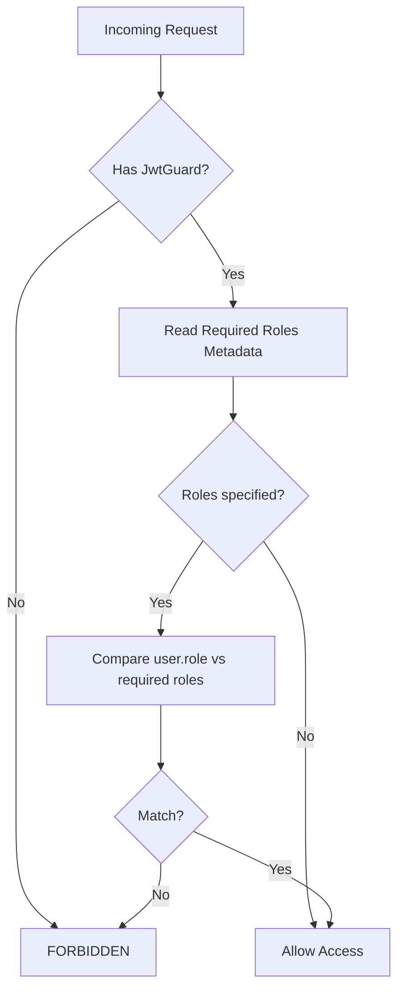
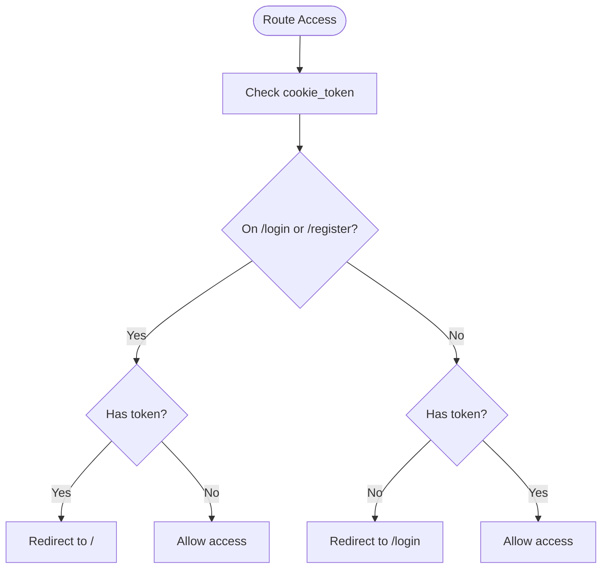
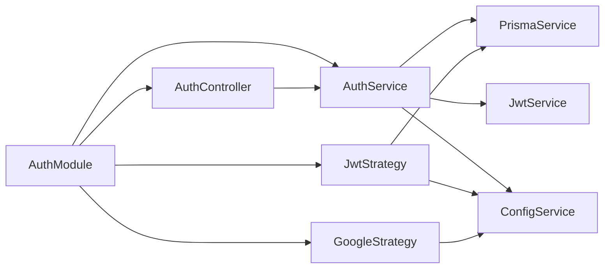

# Authentication System

<cite>
**Referenced Files in This Document**
- [auth.module.ts](file://apps/api/src/modules/auth/auth.module.ts)
- [auth.service.ts](file://apps/api/src/modules/auth/auth.service.ts)
- [auth.controller.ts](file://apps/api/src/modules/auth/auth.controller.ts)
- [jwt.guard.ts](file://apps/api/src/modules/auth/guard/jwt.guard.ts)
- [roles.guard.ts](file://apps/api/src/modules/auth/guard/roles.guard.ts)
- [google.guard.ts](file://apps/api/src/modules/auth/guard/google.guard.ts)
- [jwt.strategy.ts](file://apps/api/src/modules/auth/strategy/jwt.strategy.ts)
- [google.strategy.ts](file://apps/api/src/modules/auth/strategy/google.strategy.ts)
- [get-user.decorator.ts](file://apps/api/src/modules/auth/decorator/get-user.decorator.ts)
- [roles.decorator.ts](file://apps/api/src/modules/auth/decorator/roles.decorator.ts)
- [auth.dto.ts](file://apps/api/src/modules/auth/dto/auth.dto.ts)
- [middleware.ts](file://apps/web/middleware.ts)
- [api-client.ts](file://apps/web/lib/api-client.ts)
- [login.page.tsx](file://apps/web/app/(auth)/login/page.tsx)
- [register.page.tsx](file://apps/web/app/(auth)/register/page.tsx)
</cite>

## Table of Contents
1. [Introduction](#introduction)
2. [Project Structure](#project-structure)
3. [Core Components](#core-components)
4. [Architecture Overview](#architecture-overview)
5. [Detailed Component Analysis](#detailed-component-analysis)
6. [Dependency Analysis](#dependency-analysis)
7. [Performance Considerations](#performance-considerations)
8. [Security Considerations](#security-considerations)
9. [Troubleshooting Guide](#troubleshooting-guide)
10. [Conclusion](#conclusion)

## Introduction
This document provides comprehensive authentication system documentation for a NestJS + Next.js application. It covers user registration and login, JWT token management, Google OAuth integration, and role-based access control. The system uses cookie-based sessions with httpOnly cookies, Argon2 for password hashing, and guards/strategies for middleware integration. It also explains token generation/validation, session lifecycle, and logout procedures.

## Project Structure
The authentication system spans two applications:
- Backend (NestJS): Handles user registration, login, Google OAuth, JWT signing, guards, and strategies.
- Frontend (Next.js): Manages user-facing flows, cookie-based session handling, and middleware protection.



**Diagram sources**
- [auth.module.ts:1-14](file://apps/api/src/modules/auth/auth.module.ts#L1-L14)
- [auth.controller.ts:1-119](file://apps/api/src/modules/auth/auth.controller.ts#L1-L119)
- [auth.service.ts:1-101](file://apps/api/src/modules/auth/auth.service.ts#L1-L101)
- [jwt.guard.ts:1-8](file://apps/api/src/modules/auth/guard/jwt.guard.ts#L1-L8)
- [roles.guard.ts:1-50](file://apps/api/src/modules/auth/guard/roles.guard.ts#L1-L50)
- [google.guard.ts:1-4](file://apps/api/src/modules/auth/guard/google.guard.ts#L1-L4)
- [jwt.strategy.ts:1-46](file://apps/api/src/modules/auth/strategy/jwt.strategy.ts#L1-L46)
- [google.strategy.ts:1-55](file://apps/api/src/modules/auth/strategy/google.strategy.ts#L1-L55)
- [auth.dto.ts:1-40](file://apps/api/src/modules/auth/dto/auth.dto.ts#L1-L40)
- [middleware.ts:1-25](file://apps/web/middleware.ts#L1-L25)
- [api-client.ts:1-12](file://apps/web/lib/api-client.ts#L1-L12)
- [login.page.tsx:1-254](file://apps/web/app/(auth)/login/page.tsx#L1-L254)
- [register.page.tsx:1-303](file://apps/web/app/(auth)/register/page.tsx#L1-L303)

**Section sources**
- [auth.module.ts:1-14](file://apps/api/src/modules/auth/auth.module.ts#L1-L14)
- [auth.controller.ts:1-119](file://apps/api/src/modules/auth/auth.controller.ts#L1-L119)
- [middleware.ts:1-25](file://apps/web/middleware.ts#L1-L25)

## Core Components
- AuthModule: Declares the module, imports the JWT module, registers controllers/providers, and exposes guards/strategies.
- AuthController: Exposes endpoints for registration, login, logout, and Google OAuth initiation and callback.
- AuthService: Implements business logic for registration, login, Google login, and JWT token signing.
- Guards and Strategies: JwtGuard, RolesGuard, GoogleGuard integrate with Passport strategies for JWT and Google OAuth.
- DTOs: Strongly typed request bodies for registration and login.
- Frontend Middleware and API Client: Enforce session protection and handle cookie-based authentication.

**Section sources**
- [auth.module.ts:1-14](file://apps/api/src/modules/auth/auth.module.ts#L1-L14)
- [auth.controller.ts:1-119](file://apps/api/src/modules/auth/auth.controller.ts#L1-L119)
- [auth.service.ts:1-101](file://apps/api/src/modules/auth/auth.service.ts#L1-L101)
- [jwt.guard.ts:1-8](file://apps/api/src/modules/auth/guard/jwt.guard.ts#L1-L8)
- [roles.guard.ts:1-50](file://apps/api/src/modules/auth/guard/roles.guard.ts#L1-L50)
- [google.guard.ts:1-4](file://apps/api/src/modules/auth/guard/google.guard.ts#L1-L4)
- [auth.dto.ts:1-40](file://apps/api/src/modules/auth/dto/auth.dto.ts#L1-L40)
- [middleware.ts:1-25](file://apps/web/middleware.ts#L1-L25)
- [api-client.ts:1-12](file://apps/web/lib/api-client.ts#L1-L12)

## Architecture Overview
The authentication system follows a layered architecture:
- Controllers handle HTTP requests and responses, apply guards, and manage cookies.
- Services encapsulate business logic, including password hashing, database operations, and JWT signing.
- Guards and strategies enforce authentication and authorization policies.
- Frontend middleware protects routes and ensures authenticated access.



**Diagram sources**
- [auth.controller.ts:32-119](file://apps/api/src/modules/auth/auth.controller.ts#L32-L119)
- [auth.service.ts:17-80](file://apps/api/src/modules/auth/auth.service.ts#L17-L80)
- [jwt.strategy.ts:32-44](file://apps/api/src/modules/auth/strategy/jwt.strategy.ts#L32-L44)

## Detailed Component Analysis

### Registration and Login Flow
- Registration:
  - Validates DTO using Zod pipe.
  - Hashes password with Argon2.
  - Creates user in the database.
  - Signs JWT with user payload and returns token.
  - Sets httpOnly cookie for session persistence.
- Login:
  - Finds user by email.
  - Verifies password with Argon2.
  - Returns signed JWT and sets cookie.



**Diagram sources**
- [auth.controller.ts:40-72](file://apps/api/src/modules/auth/auth.controller.ts#L40-L72)
- [auth.service.ts:17-52](file://apps/api/src/modules/auth/auth.service.ts#L17-L52)

**Section sources**
- [auth.controller.ts:40-72](file://apps/api/src/modules/auth/auth.controller.ts#L40-L72)
- [auth.service.ts:17-52](file://apps/api/src/modules/auth/auth.service.ts#L17-L52)
- [auth.dto.ts:11-39](file://apps/api/src/modules/auth/dto/auth.dto.ts#L11-L39)

### JWT Token Management
- Token Generation:
  - Payload includes subject (userId), email, and role.
  - Secret and expiry configured via environment variables.
- Token Validation:
  - Strategy extracts token from cookie or Authorization header.
  - Validates signature and loads user from DB.
  - Strips sensitive fields before attaching to request.

```mermaid
classDiagram
class JwtStrategy {
+constructor(config, prisma)
+validate(payload) User
}
class AuthService {
+signToken(userId, email, role) Promise~{access_token}~
}
class JwtGuard {
+constructor()
}
JwtStrategy --> AuthService : "used by"
JwtGuard --> JwtStrategy : "uses"
```

**Diagram sources**
- [jwt.strategy.ts:8-46](file://apps/api/src/modules/auth/strategy/jwt.strategy.ts#L8-L46)
- [auth.service.ts:82-99](file://apps/api/src/modules/auth/auth.service.ts#L82-L99)
- [jwt.guard.ts:1-8](file://apps/api/src/modules/auth/guard/jwt.guard.ts#L1-L8)

**Section sources**
- [auth.service.ts:82-99](file://apps/api/src/modules/auth/auth.service.ts#L82-L99)
- [jwt.strategy.ts:19-44](file://apps/api/src/modules/auth/strategy/jwt.strategy.ts#L19-L44)

### Google OAuth Integration
- Strategy:
  - Configured with client ID/secret, callback URL, scopes, and offline access.
  - Validates access/refresh tokens and returns normalized user profile.
- Controller:
  - Initiates OAuth flow and handles callback.
  - Upserts user in DB and signs JWT.
  - Sets cookie and redirects to frontend with token.



**Diagram sources**
- [google.guard.ts:1-4](file://apps/api/src/modules/auth/guard/google.guard.ts#L1-L4)
- [google.strategy.ts:11-55](file://apps/api/src/modules/auth/strategy/google.strategy.ts#L11-L55)
- [auth.controller.ts:94-119](file://apps/api/src/modules/auth/auth.controller.ts#L94-L119)
- [auth.service.ts:54-80](file://apps/api/src/modules/auth/auth.service.ts#L54-L80)

**Section sources**
- [google.strategy.ts:11-55](file://apps/api/src/modules/auth/strategy/google.strategy.ts#L11-L55)
- [auth.controller.ts:94-119](file://apps/api/src/modules/auth/auth.controller.ts#L94-L119)
- [auth.service.ts:54-80](file://apps/api/src/modules/auth/auth.service.ts#L54-L80)

### Role-Based Access Control (RBAC)
- Decorators:
  - Roles decorator sets metadata for required roles.
  - RolesGuard reads metadata and compares against request.user.role.
- Guards:
  - JwtGuard ensures authenticated requests.
  - RolesGuard enforces role permissions.



**Diagram sources**
- [roles.guard.ts:18-48](file://apps/api/src/modules/auth/guard/roles.guard.ts#L18-L48)
- [roles.decorator.ts:1-11](file://apps/api/src/modules/auth/decorator/roles.decorator.ts#L1-L11)
- [jwt.guard.ts:1-8](file://apps/api/src/modules/auth/guard/jwt.guard.ts#L1-L8)

**Section sources**
- [roles.guard.ts:18-48](file://apps/api/src/modules/auth/guard/roles.guard.ts#L18-L48)
- [roles.decorator.ts:1-11](file://apps/api/src/modules/auth/decorator/roles.decorator.ts#L1-L11)
- [jwt.guard.ts:1-8](file://apps/api/src/modules/auth/guard/jwt.guard.ts#L1-L8)

### Session Management and Logout
- Cookie Policy:
  - Name: cookie_token
  - Attributes: httpOnly, secure (production), sameSite (strict in production), path '/', maxAge 24h.
- Login/Register:
  - Backend sets cookie on successful authentication.
- Logout:
  - Clears cookie and returns success message.
- Frontend Protection:
  - Middleware checks cookie presence for protected routes.
  - Redirects unauthenticated users to login and authenticated users away from auth pages.



**Diagram sources**
- [middleware.ts:4-21](file://apps/web/middleware.ts#L4-L21)
- [auth.controller.ts:78-90](file://apps/api/src/modules/auth/auth.controller.ts#L78-L90)

**Section sources**
- [auth.controller.ts:21-30](file://apps/api/src/modules/auth/auth.controller.ts#L21-L30)
- [auth.controller.ts:78-90](file://apps/api/src/modules/auth/auth.controller.ts#L78-L90)
- [middleware.ts:4-21](file://apps/web/middleware.ts#L4-L21)

### Frontend Integration
- API Client:
  - Enables credentials to send cookies cross-origin.
- Login Page:
  - Submits credentials to backend.
  - On success, receives cookie and navigates to dashboard.
- Register Page:
  - Submits registration data to backend.
  - On success, navigates to login.

**Section sources**
- [api-client.ts:1-12](file://apps/web/lib/api-client.ts#L1-L12)
- [login.page.tsx:44-69](file://apps/web/app/(auth)/login/page.tsx#L44-L69)
- [register.page.tsx:41-77](file://apps/web/app/(auth)/register/page.tsx#L41-L77)

## Dependency Analysis
- Module Dependencies:
  - AuthModule imports JwtModule and registers AuthController, AuthService, JwtStrategy, GoogleStrategy.
- Controller Dependencies:
  - AuthController depends on AuthService and uses guards and pipes.
- Service Dependencies:
  - AuthService depends on PrismaService, JwtService, and ConfigService.
- Strategy Dependencies:
  - JwtStrategy depends on ConfigService and PrismaService.
  - GoogleStrategy depends on ConfigService.



**Diagram sources**
- [auth.module.ts:8-12](file://apps/api/src/modules/auth/auth.module.ts#L8-L12)
- [auth.controller.ts:14-35](file://apps/api/src/modules/auth/auth.controller.ts#L14-L35)
- [auth.service.ts:11-15](file://apps/api/src/modules/auth/auth.service.ts#L11-L15)
- [jwt.strategy.ts:10-13](file://apps/api/src/modules/auth/strategy/jwt.strategy.ts#L10-L13)
- [google.strategy.ts:12-13](file://apps/api/src/modules/auth/strategy/google.strategy.ts#L12-L13)

**Section sources**
- [auth.module.ts:8-12](file://apps/api/src/modules/auth/auth.module.ts#L8-L12)
- [auth.controller.ts:14-35](file://apps/api/src/modules/auth/auth.controller.ts#L14-L35)
- [auth.service.ts:11-15](file://apps/api/src/modules/auth/auth.service.ts#L11-L15)
- [jwt.strategy.ts:10-13](file://apps/api/src/modules/auth/strategy/jwt.strategy.ts#L10-L13)
- [google.strategy.ts:12-13](file://apps/api/src/modules/auth/strategy/google.strategy.ts#L12-L13)

## Performance Considerations
- Token Expiry: Configure JWT expiration to balance security and user experience.
- Cookie Size: Keep cookie payload minimal (only essential claims).
- Argon2 Cost: Tune Argon2 parameters for acceptable verification latency.
- Database Indexes: Ensure unique index on email for efficient user lookup.
- Strategy Caching: Consider caching validated user profiles if needed.

## Security Considerations
- Cookie Security:
  - httpOnly prevents XSS access to the cookie.
  - Secure flag requires HTTPS in production.
  - SameSite mitigates CSRF attacks.
- Token Scope:
  - Include only necessary claims in the JWT payload.
  - Avoid storing sensitive data in tokens.
- Input Validation:
  - DTOs enforce strict validation and minimum length requirements.
- OAuth Consent:
  - Prompt for consent to obtain refresh tokens for offline access scenarios.
- Error Handling:
  - Generic messages prevent information leakage during authentication failures.

**Section sources**
- [auth.controller.ts:21-30](file://apps/api/src/modules/auth/auth.controller.ts#L21-L30)
- [auth.dto.ts:11-39](file://apps/api/src/modules/auth/dto/auth.dto.ts#L11-L39)
- [google.strategy.ts:30-33](file://apps/api/src/modules/auth/strategy/google.strategy.ts#L30-L33)

## Troubleshooting Guide
- Common Issues:
  - Missing JWT_SECRET or GOOGLE_* environment variables cause strategy initialization errors.
  - Invalid credentials result in FORBIDDEN responses.
  - Duplicate email triggers a specific error during registration.
  - Missing cookie_token leads to redirection to login in middleware.
- Debug Tips:
  - Verify environment variables are loaded by the backend.
  - Confirm cookie attributes match frontend expectations (sameSite, secure).
  - Check Prisma schema for unique constraints on email.
  - Inspect browser network tab for Set-Cookie headers and redirects.

**Section sources**
- [jwt.strategy.ts:14-17](file://apps/api/src/modules/auth/strategy/jwt.strategy.ts#L14-L17)
- [auth.service.ts:30-40](file://apps/api/src/modules/auth/auth.service.ts#L30-L40)
- [middleware.ts:10-18](file://apps/web/middleware.ts#L10-L18)

## Conclusion
The authentication system integrates robust cookie-based sessions, Argon2 password hashing, JWT token management, and Google OAuth with role-based access control. Guards and strategies provide clean separation of concerns, while frontend middleware ensures seamless user experience and security. Proper configuration of environment variables and cookie policies is essential for production readiness.