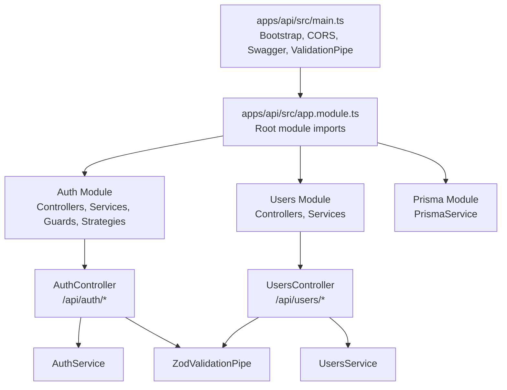
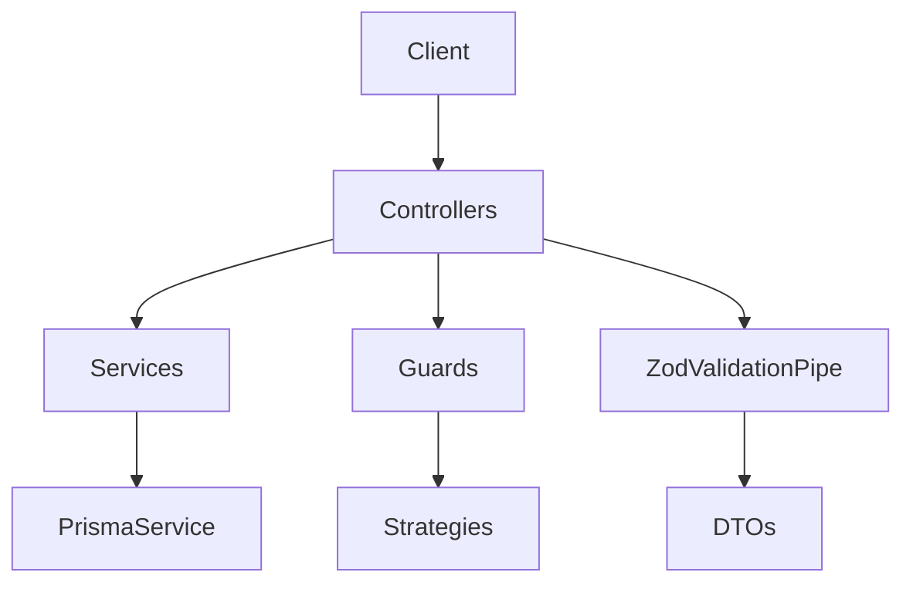
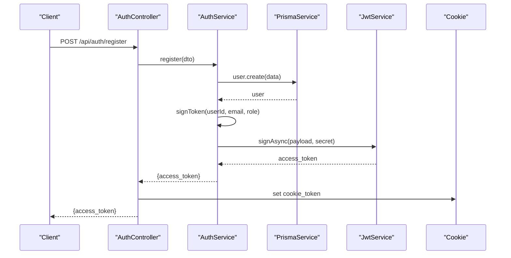
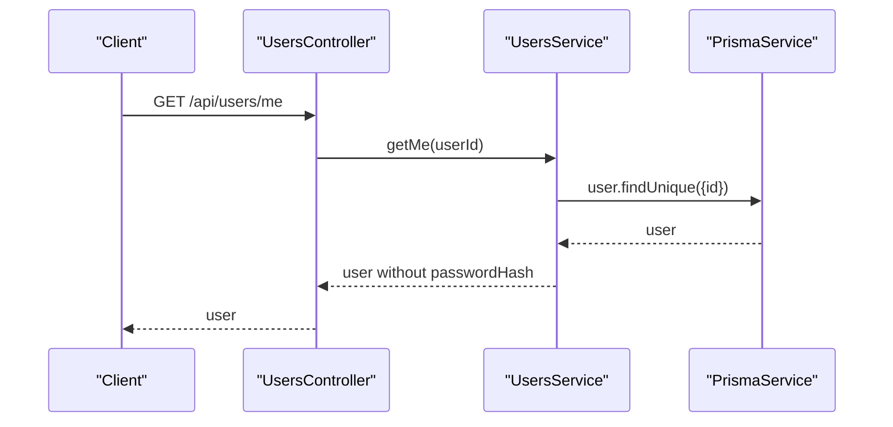
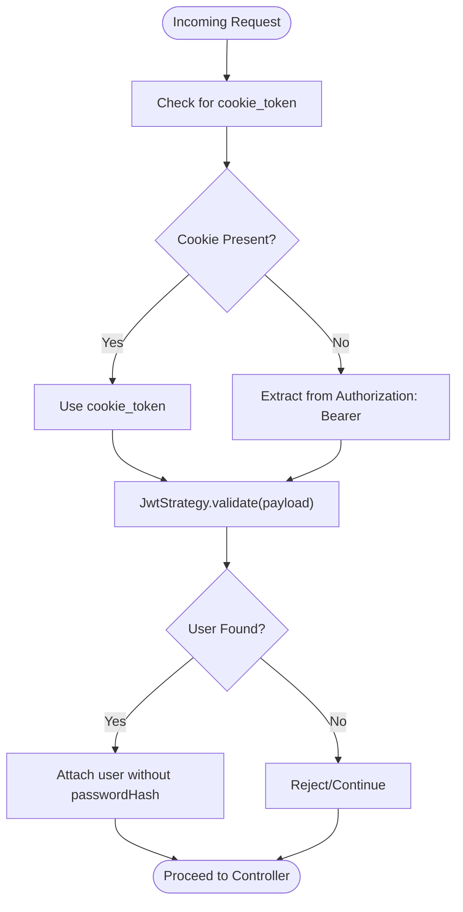
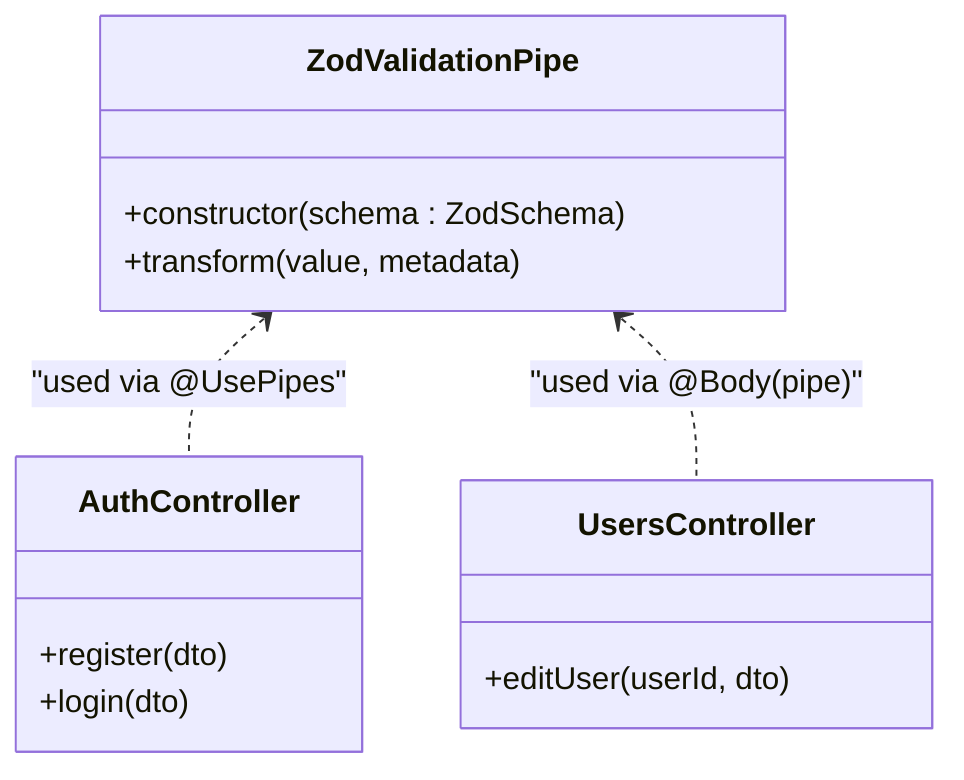
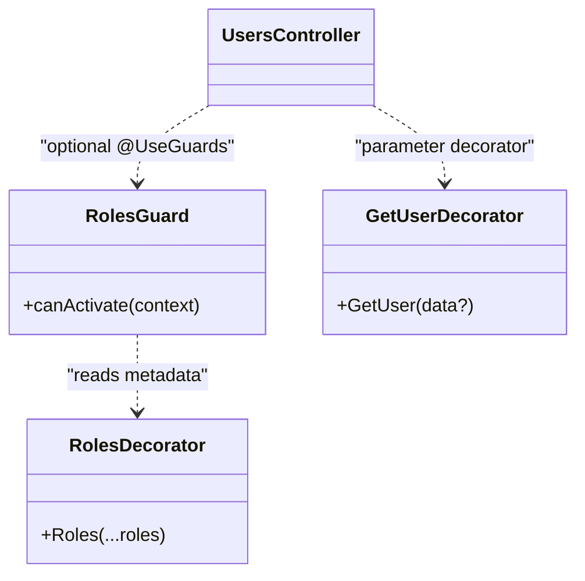
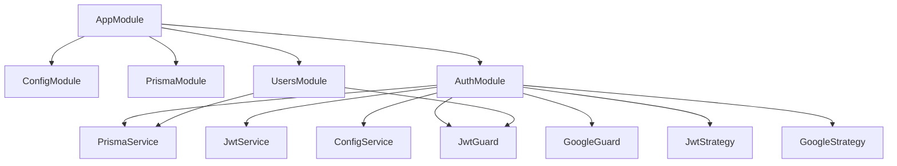

# Backend API Documentation

<cite>
**Referenced Files in This Document**
- [main.ts](file://apps/api/src/main.ts)
- [app.module.ts](file://apps/api/src/app.module.ts)
- [zod.pipe.ts](file://apps/api/src/lib/pipes/zod.pipe.ts)
- [auth.controller.ts](file://apps/api/src/modules/auth/auth.controller.ts)
- [auth.service.ts](file://apps/api/src/modules/auth/auth.service.ts)
- [auth.dto.ts](file://apps/api/src/modules/auth/dto/auth.dto.ts)
- [jwt.guard.ts](file://apps/api/src/modules/auth/guard/jwt.guard.ts)
- [google.guard.ts](file://apps/api/src/modules/auth/guard/google.guard.ts)
- [jwt.strategy.ts](file://apps/api/src/modules/auth/strategy/jwt.strategy.ts)
- [google.strategy.ts](file://apps/api/src/modules/auth/strategy/google.strategy.ts)
- [roles.guard.ts](file://apps/api/src/modules/auth/guard/roles.guard.ts)
- [get-user.decorator.ts](file://apps/api/src/modules/auth/decorator/get-user.decorator.ts)
- [roles.decorator.ts](file://apps/api/src/modules/auth/decorator/roles.decorator.ts)
- [users.controller.ts](file://apps/api/src/modules/users/users.controller.ts)
- [users.service.ts](file://apps/api/src/modules/users/users.service.ts)
- [edit-user.dto.ts](file://apps/api/src/modules/users/dto/edit-user.dto.ts)
</cite>

## Table of Contents
1. [Introduction](#introduction)
2. [Project Structure](#project-structure)
3. [Core Components](#core-components)
4. [Architecture Overview](#architecture-overview)
5. [Detailed Component Analysis](#detailed-component-analysis)
6. [Dependency Analysis](#dependency-analysis)
7. [Performance Considerations](#performance-considerations)
8. [Troubleshooting Guide](#troubleshooting-guide)
9. [Conclusion](#conclusion)

## Introduction
This document provides comprehensive API documentation for the NestJS backend service. It covers all RESTful endpoints, request/response schemas, authentication methods, error handling patterns, controller organization, service layer implementation, and data validation using Zod pipes. The backend follows a modular architecture with dependency injection, middleware implementations, and guard-based authorization.

## Project Structure
The backend is organized as a NestJS application with separate modules for authentication and users, a shared Zod validation pipe, and global configuration in the main entry point.

**Diagram sources**
- [main.ts:1-43](file://apps/api/src/main.ts#L1-L43)
- [app.module.ts:1-20](file://apps/api/src/app.module.ts#L1-L20)
- [auth.controller.ts:32-35](file://apps/api/src/modules/auth/auth.controller.ts#L32-L35)
- [users.controller.ts:23-28](file://apps/api/src/modules/users/users.controller.ts#L23-L28)

**Section sources**
- [main.ts:1-43](file://apps/api/src/main.ts#L1-L43)
- [app.module.ts:1-20](file://apps/api/src/app.module.ts#L1-L20)

## Core Components
- Global Bootstrap and Middleware
  - Cookie parsing enabled for JWT cookie extraction.
  - CORS configured for cross-origin requests with credentials support.
  - Global prefix set to /api with exclusion for health check.
  - ValidationPipe applied globally to enforce whitelisting, transformation, and non-whitelisted forbidding.
  - Swagger/OpenAPI documentation exposed at /docs.
- Modular Architecture
  - Root AppModule imports ConfigModule, PrismaModule, AuthModule, and UsersModule.
  - Feature modules encapsulate domain-specific concerns.

**Section sources**
- [main.ts:7-42](file://apps/api/src/main.ts#L7-L42)
- [app.module.ts:9-19](file://apps/api/src/app.module.ts#L9-L19)

## Architecture Overview
The system uses a layered architecture:
- Controllers handle HTTP requests and responses.
- Services encapsulate business logic and coordinate with PrismaService.
- Guards enforce authentication and authorization.
- Strategies implement JWT and Google OAuth2 authentication flows.
- Pipes validate incoming payloads using Zod schemas.

**Diagram sources**
- [auth.controller.ts:34-35](file://apps/api/src/modules/auth/auth.controller.ts#L34-L35)
- [users.controller.ts:27-28](file://apps/api/src/modules/users/users.controller.ts#L27-L28)
- [auth.service.ts:9-15](file://apps/api/src/modules/auth/auth.service.ts#L9-L15)
- [users.service.ts:6-8](file://apps/api/src/modules/users/users.service.ts#L6-L8)
- [jwt.guard.ts:3](file://apps/api/src/modules/auth/guard/jwt.guard.ts#L3)
- [google.guard.ts:3](file://apps/api/src/modules/auth/guard/google.guard.ts#L3)
- [jwt.strategy.ts:9-29](file://apps/api/src/modules/auth/strategy/jwt.strategy.ts#L9-L29)
- [google.strategy.ts:12-35](file://apps/api/src/modules/auth/strategy/google.strategy.ts#L12-L35)
- [zod.pipe.ts:4-18](file://apps/api/src/lib/pipes/zod.pipe.ts#L4-L18)

## Detailed Component Analysis

### Authentication Endpoints
- Base Path: /api/auth
- Authentication Methods:
  - Cookie-based JWT: Access token stored in a cookie named cookie_token with httpOnly, secure, sameSite, and maxAge settings.
  - Bearer fallback: JWT can also be sent via Authorization: Bearer header when cookie is unavailable.
  - Google OAuth2: Redirect-based flow with callback handling.

Endpoints:
- POST /api/auth/register
  - Description: Registers a new user with email, password, and optional full name.
  - Authentication: None.
  - Request Body: RegisterDto validated by ZodValidationPipe(RegisterSchema).
  - Response: Returns access_token in cookie_token and response body containing access_token.
  - Success: 201 Created.
  - Errors: 403 Forbidden if email already exists.
  - Example Request: See [auth.controller.ts:46-53](file://apps/api/src/modules/auth/auth.controller.ts#L46-L53).
  - Example Response: See [auth.controller.ts:50](file://apps/api/src/modules/auth/auth.controller.ts#L50).

- POST /api/auth/login
  - Description: Logs in a user with email and password, returning a JWT access token.
  - Authentication: None.
  - Request Body: LoginDto validated by ZodValidationPipe(LoginSchema).
  - Response: Returns access_token in cookie_token and response body containing access_token.
  - Success: 200 OK.
  - Errors: 403 Forbidden for invalid credentials.
  - Example Request: See [auth.controller.ts:65-72](file://apps/api/src/modules/auth/auth.controller.ts#L65-L72).

- POST /api/auth/logout
  - Description: Clears the authentication cookie and returns a success message.
  - Authentication: None.
  - Response: JSON with message.
  - Success: 200 OK.
  - Example Response: See [auth.controller.ts:89](file://apps/api/src/modules/auth/auth.controller.ts#L89).

- GET /api/auth/google
  - Description: Initiates Google OAuth2 login via GoogleGuard.
  - Authentication: None.
  - Response: Redirects to Google OAuth consent page.
  - Success: 302 Found.
  - Example Flow: See [auth.controller.ts:95-100](file://apps/api/src/modules/auth/auth.controller.ts#L95-L100).

- GET /api/auth/google/callback
  - Description: Handles Google OAuth2 callback, sets cookie_token, and redirects to frontend.
  - Authentication: None.
  - Response: Redirects to FRONTEND_URL with token query parameter.
  - Success: 302 Found.
  - Example Flow: See [auth.controller.ts:106-118](file://apps/api/src/modules/auth/auth.controller.ts#L106-L118).

**Diagram sources**
- [auth.controller.ts:40-53](file://apps/api/src/modules/auth/auth.controller.ts#L40-L53)
- [auth.service.ts:17-41](file://apps/api/src/modules/auth/auth.service.ts#L17-L41)
- [jwt.strategy.ts:82-99](file://apps/api/src/modules/auth/strategy/jwt.strategy.ts#L82-L99)

**Section sources**
- [auth.controller.ts:37-119](file://apps/api/src/modules/auth/auth.controller.ts#L37-L119)
- [auth.service.ts:17-101](file://apps/api/src/modules/auth/auth.service.ts#L17-L101)
- [auth.dto.ts:11-39](file://apps/api/src/modules/auth/dto/auth.dto.ts#L11-L39)
- [jwt.strategy.ts:19-44](file://apps/api/src/modules/auth/strategy/jwt.strategy.ts#L19-L44)

### Users Endpoints
- Base Path: /api/users
- Authentication: Requires JWT (JwtGuard).
- Authorization: Not enforced by default; roles guard can be applied via @Roles decorator.

Endpoints:
- GET /api/users/me
  - Description: Retrieves the authenticated user's profile.
  - Authentication: Required (JWT).
  - Response: User object without passwordHash.
  - Success: 200 OK.
  - Errors: 401 Unauthorized if not authenticated; 404 Not Found if user does not exist.
  - Example Response: See [users.controller.ts:34-36](file://apps/api/src/modules/users/users.controller.ts#L34-L36).

- PATCH /api/users
  - Description: Updates the authenticated user's profile.
  - Authentication: Required (JWT).
  - Request Body: EditUserDto validated by ZodValidationPipe(EditUserSchema).
  - Response: Updated user object without passwordHash.
  - Success: 200 OK.
  - Errors: 401 Unauthorized if not authenticated; 404 Not Found if user does not exist.
  - Example Request: See [users.controller.ts:42-47](file://apps/api/src/modules/users/users.controller.ts#L42-L47).

**Diagram sources**
- [users.controller.ts:30-36](file://apps/api/src/modules/users/users.controller.ts#L30-L36)
- [users.service.ts:10-21](file://apps/api/src/modules/users/users.service.ts#L10-L21)

**Section sources**
- [users.controller.ts:30-48](file://apps/api/src/modules/users/users.controller.ts#L30-L48)
- [users.service.ts:10-33](file://apps/api/src/modules/users/users.service.ts#L10-L33)
- [edit-user.dto.ts](file://apps/api/src/modules/users/dto/edit-user.dto.ts)

### Authentication Flow Details
- JWT Guard and Strategy
  - JwtGuard extends AuthGuard('jwt').
  - JwtStrategy extracts token from cookie_token if present; otherwise falls back to Authorization: Bearer header.
  - Validates payload against Prisma user lookup and strips passwordHash before attaching to request.
- Google OAuth2 Guard and Strategy
  - GoogleGuard extends AuthGuard('google').
  - GoogleStrategy configures client ID/secret, callback URL, scopes, and prompts for offline access and consent.
  - Validates access/refresh tokens and returns user profile data.

**Diagram sources**
- [jwt.strategy.ts:20-44](file://apps/api/src/modules/auth/strategy/jwt.strategy.ts#L20-L44)
- [jwt.guard.ts:3](file://apps/api/src/modules/auth/guard/jwt.guard.ts#L3)

**Section sources**
- [jwt.guard.ts:1-8](file://apps/api/src/modules/auth/guard/jwt.guard.ts#L1-L8)
- [jwt.strategy.ts:9-46](file://apps/api/src/modules/auth/strategy/jwt.strategy.ts#L9-L46)
- [google.guard.ts:1-4](file://apps/api/src/modules/auth/guard/google.guard.ts#L1-L4)
- [google.strategy.ts:12-55](file://apps/api/src/modules/auth/strategy/google.strategy.ts#L12-L55)

### Data Validation Using Zod Pipes
- ZodValidationPipe
  - Applied to controller methods to validate request bodies using Zod schemas.
  - Throws BadRequestException with a descriptive message on validation failure.
  - Only applies to body parameters.
- DTOs
  - RegisterDto and LoginDto use class-validator decorators for basic validation.
  - Additional Zod schemas (RegisterSchema, LoginSchema, EditUserSchema) are referenced from @repo/dto.

**Diagram sources**
- [zod.pipe.ts:4-18](file://apps/api/src/lib/pipes/zod.pipe.ts#L4-L18)
- [auth.controller.ts:45](file://apps/api/src/modules/auth/auth.controller.ts#L45)
- [auth.controller.ts:64](file://apps/api/src/modules/auth/auth.controller.ts#L64)
- [users.controller.ts:44](file://apps/api/src/modules/users/users.controller.ts#L44)

**Section sources**
- [zod.pipe.ts:1-19](file://apps/api/src/lib/pipes/zod.pipe.ts#L1-L19)
- [auth.controller.ts:45-64](file://apps/api/src/modules/auth/auth.controller.ts#L45-L64)
- [users.controller.ts:42-47](file://apps/api/src/modules/users/users.controller.ts#L42-L47)

### Authorization Guards and Decorators
- JwtGuard
  - Enforces JWT-based authentication for protected routes.
- RolesGuard
  - Restricts access based on user roles using @Roles decorator metadata.
  - Throws HTTP 403 Forbidden if user lacks required role.
- GetUser Decorator
  - Extracts user object or specific property from request context.
- Roles Decorator
  - Sets metadata for required roles at controller/handler level.

**Diagram sources**
- [roles.guard.ts:15-48](file://apps/api/src/modules/auth/guard/roles.guard.ts#L15-L48)
- [roles.decorator.ts:10](file://apps/api/src/modules/auth/decorator/roles.decorator.ts#L10)
- [get-user.decorator.ts:6-17](file://apps/api/src/modules/auth/decorator/get-user.decorator.ts#L6-L17)

**Section sources**
- [roles.guard.ts:1-50](file://apps/api/src/modules/auth/guard/roles.guard.ts#L1-L50)
- [roles.decorator.ts:1-11](file://apps/api/src/modules/auth/decorator/roles.decorator.ts#L1-L11)
- [get-user.decorator.ts:1-18](file://apps/api/src/modules/auth/decorator/get-user.decorator.ts#L1-L18)

## Dependency Analysis
- Module Dependencies
  - AppModule imports ConfigModule, PrismaModule, AuthModule, and UsersModule.
  - AuthModule depends on PrismaService, JwtService, ConfigService, and Passport strategies/guards.
  - UsersModule depends on PrismaService and JwtGuard.
- External Integrations
  - Argon2 for password hashing.
  - Passport strategies for JWT and Google OAuth2.
  - Prisma for database operations.

**Diagram sources**
- [app.module.ts:10-15](file://apps/api/src/app.module.ts#L10-L15)
- [auth.service.ts:9-15](file://apps/api/src/modules/auth/auth.service.ts#L9-L15)
- [users.service.ts:6-8](file://apps/api/src/modules/users/users.service.ts#L6-L8)

**Section sources**
- [app.module.ts:9-19](file://apps/api/src/app.module.ts#L9-L19)
- [auth.service.ts:9-15](file://apps/api/src/modules/auth/auth.service.ts#L9-L15)
- [users.service.ts:6-8](file://apps/api/src/modules/users/users.service.ts#L6-L8)

## Performance Considerations
- ValidationPipe
  - Global whitelist and transformation reduce unnecessary fields and normalize inputs.
- Cookie-based JWT
  - Reduces header size and avoids frequent Bearer token overhead.
- Strategy Fallback
  - Efficiently tries cookie first, then header, minimizing redundant checks.
- Password Hashing
  - Argon2 is computationally intensive; ensure appropriate cost parameters in production.

## Troubleshooting Guide
- Common Errors
  - 401 Unauthorized: Missing or invalid JWT; verify cookie_token presence or Authorization header.
  - 403 Forbidden: Invalid credentials during login/register; insufficient permissions for protected endpoints.
  - 404 Not Found: User not found when accessing profile or editing profile.
  - Validation Failures: ZodValidationPipe throws descriptive errors for invalid payloads.
- Environment Variables
  - Ensure JWT_SECRET is set for JwtStrategy initialization.
  - Configure GOOGLE_* variables for Google OAuth2 flow.
- CORS Issues
  - Confirm ALLOWED_ORIGINS and credentials settings match frontend origin.

**Section sources**
- [auth.service.ts:30-40](file://apps/api/src/modules/auth/auth.service.ts#L30-L40)
- [jwt.strategy.ts:14-17](file://apps/api/src/modules/auth/strategy/jwt.strategy.ts#L14-L17)
- [users.service.ts:15-17](file://apps/api/src/modules/users/users.service.ts#L15-L17)
- [zod.pipe.ts:12-18](file://apps/api/src/lib/pipes/zod.pipe.ts#L12-L18)

## Conclusion
The backend provides a robust, modular API with comprehensive authentication (JWT and Google OAuth2), strict input validation using Zod pipes, and clear separation of concerns across controllers and services. The Swagger documentation at /docs offers interactive API exploration, while guards and decorators enable fine-grained authorization controls.