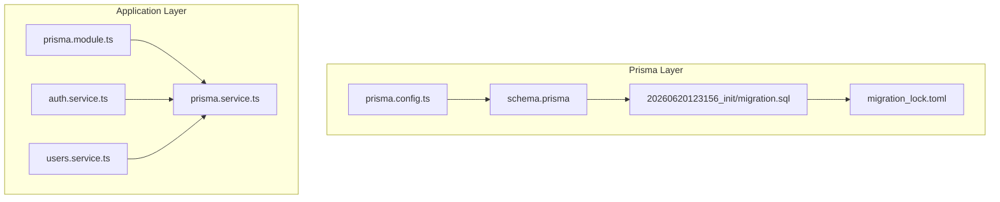
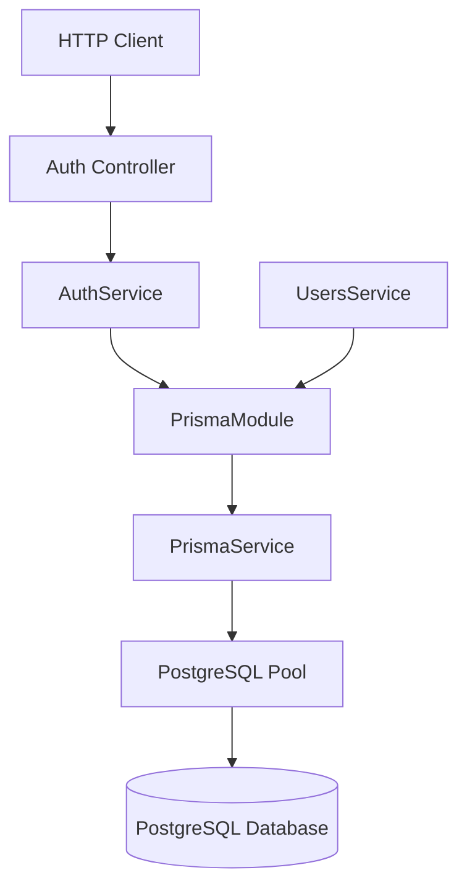
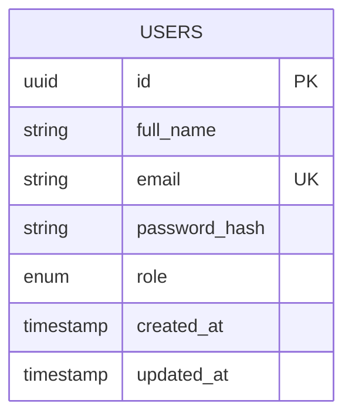
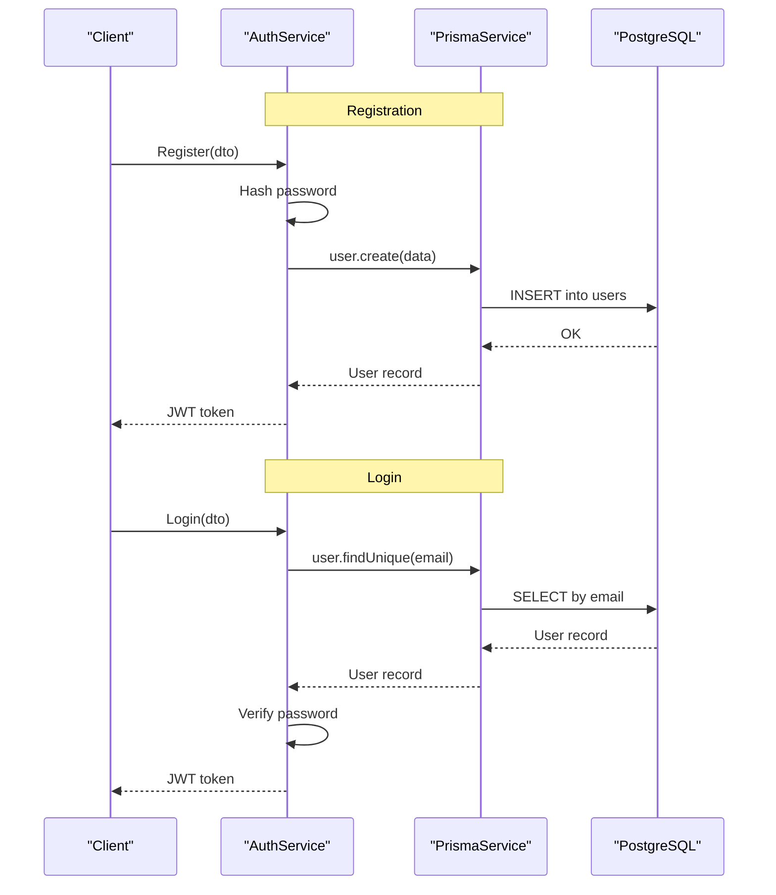
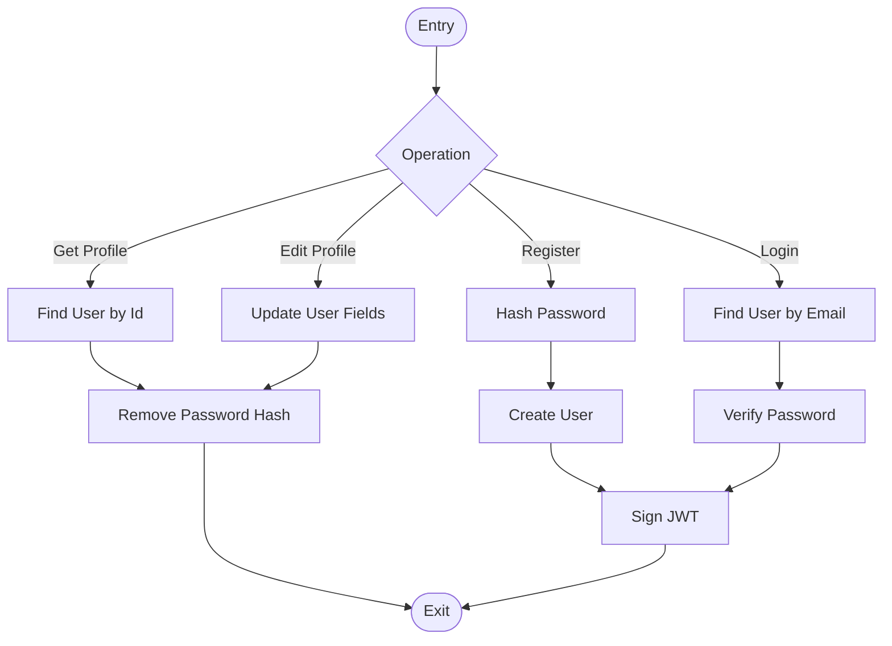
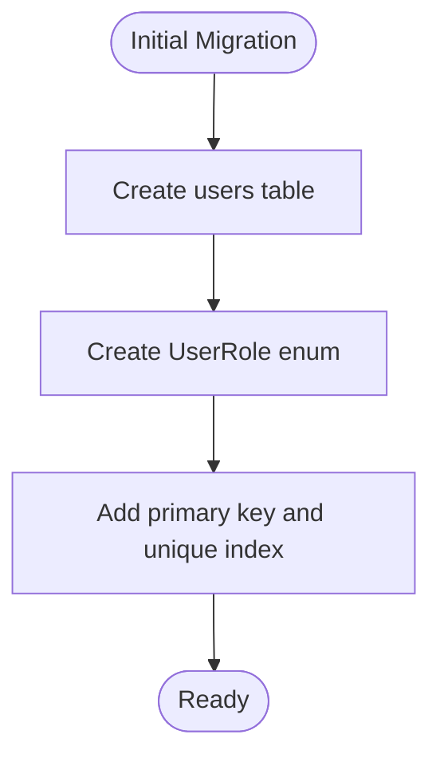
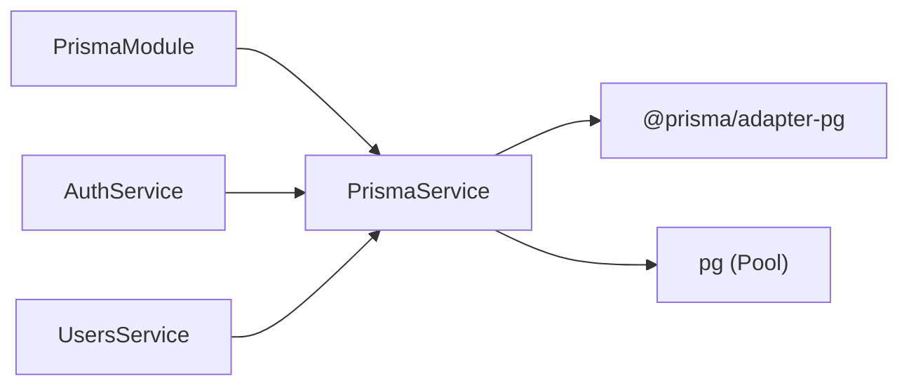

# Database Design

<cite>
**Referenced Files in This Document**
- [schema.prisma](file://apps/api/prisma/schema.prisma)
- [20260620123156_init/migration.sql](file://apps/api/prisma/migrations/20260620123156_init/migration.sql)
- [migration_lock.toml](file://apps/api/prisma/migrations/migration_lock.toml)
- [prisma.config.ts](file://apps/api/prisma.config.ts)
- [prisma.module.ts](file://apps/api/src/modules/prisma/prisma.module.ts)
- [prisma.service.ts](file://apps/api/src/modules/prisma/prisma.service.ts)
- [auth.service.ts](file://apps/api/src/modules/auth/auth.service.ts)
- [auth.dto.ts](file://apps/api/src/modules/auth/dto/auth.dto.ts)
- [users.service.ts](file://apps/api/src/modules/users/users.service.ts)
- [edit-user.dto.ts](file://apps/api/src/modules/users/dto/edit-user.dto.ts)
- [package.json](file://apps/api/package.json)
- [SECURITY.md](file://SECURITY.md)
</cite>

## Table of Contents
1. [Introduction](#introduction)
2. [Project Structure](#project-structure)
3. [Core Components](#core-components)
4. [Architecture Overview](#architecture-overview)
5. [Detailed Component Analysis](#detailed-component-analysis)
6. [Dependency Analysis](#dependency-analysis)
7. [Performance Considerations](#performance-considerations)
8. [Troubleshooting Guide](#troubleshooting-guide)
9. [Conclusion](#conclusion)
10. [Appendices](#appendices)

## Introduction
This document describes the PostgreSQL database design for the hackathon project, focusing on the Prisma schema and generated SQL. The current schema defines a single entity (User) with authentication-related fields and a role-based access model. The repository includes Prisma configuration, NestJS integration via a dedicated Prisma module, and authentication services that operate against this schema. Notably, the project does not currently define spatial data types or PostGIS extensions in the schema; any future spatial modeling would require explicit schema updates.

## Project Structure
The database design is centered around:
- Prisma schema defining the User entity and UserRole enum
- A single initial migration creating the users table with primary key and unique index on email
- Prisma configuration pointing to a PostgreSQL datasource
- NestJS integration through a global Prisma module and service
- Authentication services interacting with the User model

**Diagram sources**
- [prisma.config.ts:1-15](file://apps/api/prisma.config.ts#L1-L15)
- [schema.prisma:1-35](file://apps/api/prisma/schema.prisma#L1-L35)
- [20260620123156_init/migration.sql:1-19](file://apps/api/prisma/migrations/20260620123156_init/migration.sql#L1-L19)
- [migration_lock.toml:1-4](file://apps/api/prisma/migrations/migration_lock.toml#L1-L4)
- [prisma.module.ts:1-9](file://apps/api/src/modules/prisma/prisma.module.ts#L1-L9)
- [prisma.service.ts:1-32](file://apps/api/src/modules/prisma/prisma.service.ts#L1-L32)
- [auth.service.ts:1-101](file://apps/api/src/modules/auth/auth.service.ts#L1-L101)
- [users.service.ts:1-33](file://apps/api/src/modules/users/users.service.ts#L1-L33)

**Section sources**
- [prisma.config.ts:1-15](file://apps/api/prisma.config.ts#L1-L15)
- [schema.prisma:1-35](file://apps/api/prisma/schema.prisma#L1-L35)
- [20260620123156_init/migration.sql:1-19](file://apps/api/prisma/migrations/20260620123156_init/migration.sql#L1-L19)
- [migration_lock.toml:1-4](file://apps/api/prisma/migrations/migration_lock.toml#L1-L4)
- [prisma.module.ts:1-9](file://apps/api/src/modules/prisma/prisma.module.ts#L1-L9)
- [prisma.service.ts:1-32](file://apps/api/src/modules/prisma/prisma.service.ts#L1-L32)
- [auth.service.ts:1-101](file://apps/api/src/modules/auth/auth.service.ts#L1-L101)
- [users.service.ts:1-33](file://apps/api/src/modules/users/users.service.ts#L1-L33)

## Core Components
- Database provider: PostgreSQL configured via Prisma datasource
- Enum: UserRole with values admin, farmer, buyer, government (schema) vs. admin, user (migration)
- Model: User with fields id, full_name, email, password_hash, role, created_at, updated_at
- Constraints: Primary key on id; unique index on email
- Application integration: PrismaService extends PrismaClient and connects using @prisma/adapter-pg with a PostgreSQL connection pool

Key observations:
- The schema defines four role values while the migration defines two. This mismatch should be resolved by aligning the migration with the schema enum.
- No spatial data types or PostGIS extensions are present in the current schema.

**Section sources**
- [schema.prisma:15-34](file://apps/api/prisma/schema.prisma#L15-L34)
- [20260620123156_init/migration.sql:1-19](file://apps/api/prisma/migrations/20260620123156_init/migration.sql#L1-L19)
- [prisma.service.ts:14-23](file://apps/api/src/modules/prisma/prisma.service.ts#L14-L23)

## Architecture Overview
The data access layer integrates Prisma with NestJS using a global module pattern. Services depend on PrismaService to perform CRUD operations against the User model.

**Diagram sources**
- [prisma.module.ts:1-9](file://apps/api/src/modules/prisma/prisma.module.ts#L1-L9)
- [prisma.service.ts:14-23](file://apps/api/src/modules/prisma/prisma.service.ts#L14-L23)
- [auth.service.ts:11-15](file://apps/api/src/modules/auth/auth.service.ts#L11-L15)
- [users.service.ts:8](file://apps/api/src/modules/users/users.service.ts#L8)

## Detailed Component Analysis

### User Entity and Authentication Data Schema
The User model encapsulates authentication and profile data:
- Identity: id (UUID primary key)
- Profile: full_name (text)
- Contact: email (unique)
- Security: password_hash (text)
- Access control: role (UserRole enum)
- Metadata: created_at, updated_at timestamps

Constraints and indexes:
- Primary key: id
- Unique index: email

**Diagram sources**
- [schema.prisma:22-34](file://apps/api/prisma/schema.prisma#L22-L34)
- [20260620123156_init/migration.sql:4-18](file://apps/api/prisma/migrations/20260620123156_init/migration.sql#L4-L18)

**Section sources**
- [schema.prisma:22-34](file://apps/api/prisma/schema.prisma#L22-L34)
- [20260620123156_init/migration.sql:4-18](file://apps/api/prisma/migrations/20260620123156_init/migration.sql#L4-L18)

### Authentication Flow
The authentication service handles registration, login, and Google OAuth login. It interacts with the User model and signs JWT tokens containing user identity and role.

**Diagram sources**
- [auth.service.ts:17-52](file://apps/api/src/modules/auth/auth.service.ts#L17-L52)
- [users.service.ts:10-21](file://apps/api/src/modules/users/users.service.ts#L10-L21)

**Section sources**
- [auth.service.ts:17-52](file://apps/api/src/modules/auth/auth.service.ts#L17-L52)
- [auth.dto.ts:11-39](file://apps/api/src/modules/auth/dto/auth.dto.ts#L11-L39)
- [users.service.ts:10-21](file://apps/api/src/modules/users/users.service.ts#L10-L21)

### Data Access Patterns
- Registration: Create a new User with hashed password and default role
- Login: Find by email, verify password, return JWT
- Profile retrieval: Fetch User by id and exclude sensitive fields
- Profile editing: Update User fields by id

**Diagram sources**
- [auth.service.ts:17-52](file://apps/api/src/modules/auth/auth.service.ts#L17-L52)
- [users.service.ts:10-31](file://apps/api/src/modules/users/users.service.ts#L10-L31)

**Section sources**
- [auth.service.ts:17-52](file://apps/api/src/modules/auth/auth.service.ts#L17-L52)
- [users.service.ts:10-31](file://apps/api/src/modules/users/users.service.ts#L10-L31)

### Migration Management
- Prisma configuration specifies schema and migrations paths and seeds
- The repository includes a migration lock file indicating PostgreSQL provider
- The initial migration creates the users table and unique index on email
- There is a mismatch between the enum values defined in the schema and the migration; this should be reconciled

**Diagram sources**
- [20260620123156_init/migration.sql:1-19](file://apps/api/prisma/migrations/20260620123156_init/migration.sql#L1-L19)
- [prisma.config.ts:8-11](file://apps/api/prisma.config.ts#L8-L11)
- [migration_lock.toml:1-4](file://apps/api/prisma.migrations/migration_lock.toml#L1-L4)

**Section sources**
- [prisma.config.ts:8-11](file://apps/api/prisma.config.ts#L8-L11)
- [20260620123156_init/migration.sql:1-19](file://apps/api/prisma/migrations/20260620123156_init/migration.sql#L1-L19)
- [migration_lock.toml:1-4](file://apps/api/prisma/migrations/migration_lock.toml#L1-L4)

## Dependency Analysis
- NestJS PrismaModule exports PrismaService globally
- Services depend on PrismaService for database operations
- PrismaService uses @prisma/adapter-pg with a PostgreSQL connection pool
- Package dependencies include @prisma/client, prisma, and pg

**Diagram sources**
- [prisma.module.ts:1-9](file://apps/api/src/modules/prisma/prisma.module.ts#L1-L9)
- [prisma.service.ts:14-23](file://apps/api/src/modules/prisma/prisma.service.ts#L14-L23)
- [package.json:38-53](file://apps/api/package.json#L38-L53)

**Section sources**
- [prisma.module.ts:1-9](file://apps/api/src/modules/prisma/prisma.module.ts#L1-L9)
- [prisma.service.ts:14-23](file://apps/api/src/modules/prisma/prisma.service.ts#L14-L23)
- [package.json:38-53](file://apps/api/package.json#L38-L53)

## Performance Considerations
- Indexing: The unique index on email supports efficient lookups during authentication and user creation
- Connection pooling: Using @prisma/adapter-pg with a PostgreSQL pool improves concurrency and resource reuse
- Data types: Text fields for identifiers and hashes are appropriate; consider enum storage efficiency if expanding role cardinality
- Caching: No explicit caching layer is defined in the schema or services; application-level caching could be introduced for frequently accessed user metadata

[No sources needed since this section provides general guidance]

## Troubleshooting Guide
Common issues and resolutions:
- Email uniqueness violation: Catching Prisma error code P2002 during registration and returning a forbidden response
- Invalid credentials: Thrown when user lookup fails or password verification fails
- Role enum mismatch: Align migration enum values with schema enum values to avoid runtime errors
- JWT configuration: Ensure JWT_SECRET and expiration are set in environment variables

**Section sources**
- [auth.service.ts:30-40](file://apps/api/src/modules/auth/auth.service.ts#L30-L40)
- [auth.service.ts:47-49](file://apps/api/src/modules/auth/auth.service.ts#L47-L49)
- [SECURITY.md:43-54](file://SECURITY.md#L43-L54)

## Conclusion
The current database design centers on a robust User entity with secure authentication fields and role-based access control. The Prisma schema and migration establish a solid foundation, though the UserRole enum mismatch requires immediate attention. The NestJS integration via PrismaService provides a clean data access layer suitable for growth. Future enhancements may include additional entities, indexes, and potentially spatial modeling if the application evolves to support geographic features.

[No sources needed since this section summarizes without analyzing specific files]

## Appendices

### Appendix A: Field Definitions and Data Types
- id: UUID (primary key)
- full_name: Text
- email: Text (unique)
- password_hash: Text
- role: Enum (UserRole)
- created_at: Timestamp
- updated_at: Timestamp

**Section sources**
- [schema.prisma:22-34](file://apps/api/prisma/schema.prisma#L22-L34)
- [20260620123156_init/migration.sql:4-18](file://apps/api/prisma/migrations/20260620123156_init/migration.sql#L4-L18)

### Appendix B: Sample Data
Example rows for the users table:
- id: a1b2c3d4-e5f6-7890-a1b2-c3d4e5f67890
- full_name: "John Doe"
- email: "john.doe@example.com"
- password_hash: "$argon2id$v=..."
- role: "farmer"
- created_at: "2026-06-20T12:31:56.000Z"
- updated_at: "2026-06-20T12:31:56.000Z"

Note: The role value should match the schema enum values (admin, farmer, buyer, government).

**Section sources**
- [schema.prisma:22-34](file://apps/api/prisma/schema.prisma#L22-L34)
- [20260620123156_init/migration.sql:4-18](file://apps/api/prisma/migrations/20260620123156_init/migration.sql#L4-L18)