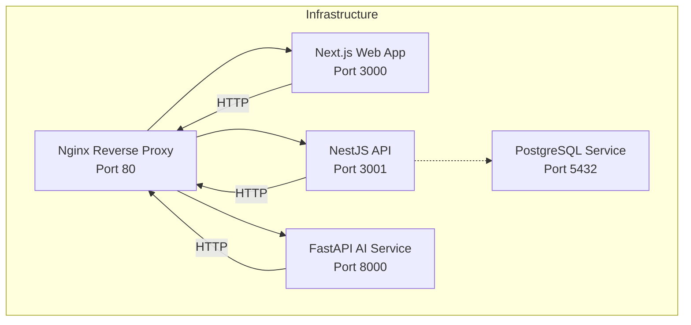
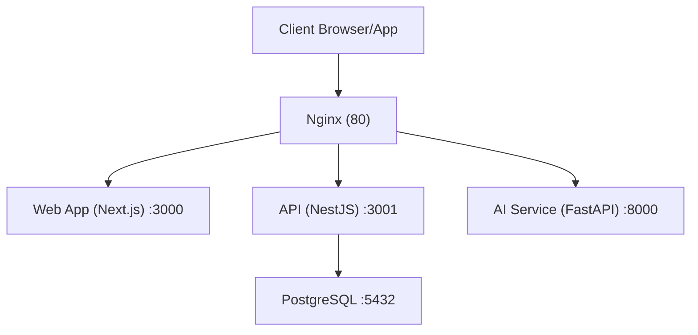
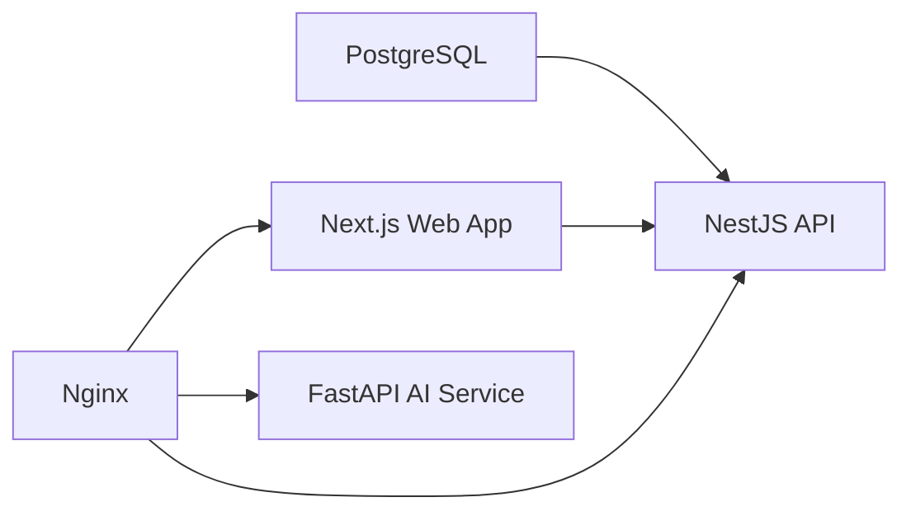

# Deployment & Infrastructure

<cite>
**Referenced Files in This Document**
- [docker-compose.yaml](file://docker-compose.yaml)
- [.github/workflows/ci-cd.yaml](file://.github/workflows/ci-cd.yaml)
- [nginx/default.conf](file://nginx/default.conf)
- [apps/web/Dockerfile](file://apps/web/Dockerfile)
- [apps/api/Dockerfile](file://apps/api/Dockerfile)
- [apps/ai-service/Dockerfile](file://apps/ai-service/Dockerfile)
- [turbo.json](file://turbo.json)
- [pnpm-workspace.yaml](file://pnpm-workspace.yaml)
- [package.json](file://package.json)
- [apps/api/src/main.ts](file://apps/api/src/main.ts)
- [apps/api/prisma/schema.prisma](file://apps/api/prisma/schema.prisma)
- [apps/api/prisma/migrations/20260620123156_init/migration.sql](file://apps/api/prisma/migrations/20260620123156_init/migration.sql)
- [apps/api/prisma.config.ts](file://apps/api/prisma.config.ts)
- [apps/web/app/layout.tsx](file://apps/web/app/layout.tsx)
</cite>

## Table of Contents
1. [Introduction](#introduction)
2. [Project Structure](#project-structure)
3. [Core Components](#core-components)
4. [Architecture Overview](#architecture-overview)
5. [Detailed Component Analysis](#detailed-component-analysis)
6. [Dependency Analysis](#dependency-analysis)
7. [Performance Considerations](#performance-considerations)
8. [Troubleshooting Guide](#troubleshooting-guide)
9. [Conclusion](#conclusion)
10. [Appendices](#appendices)

## Introduction
This document explains how the system is deployed and operated in production, focusing on containerization with Docker, reverse proxy and load balancing via Nginx, environment configuration, and the CI/CD pipeline using GitHub Actions. It also covers orchestration with Docker Compose, service discovery, scaling considerations, monitoring, and operational best practices derived from the repository’s configuration.

## Project Structure
The deployment stack consists of:
- A PostgreSQL database service
- An API service built with NestJS
- A FastAPI AI service
- A frontend Next.js application
- An Nginx reverse proxy routing traffic to the appropriate backend services

**Diagram sources**
- [docker-compose.yaml:1-83](file://docker-compose.yaml#L1-L83)
- [nginx/default.conf:1-31](file://nginx/default.conf#L1-L31)

**Section sources**
- [docker-compose.yaml:1-83](file://docker-compose.yaml#L1-L83)
- [nginx/default.conf:1-31](file://nginx/default.conf#L1-L31)

## Core Components
- Container Orchestration: Docker Compose defines services, health checks, environment variables, and inter-service dependencies.
- Reverse Proxy: Nginx routes requests to Next.js (frontend), NestJS (backend), and FastAPI (AI service) based on path prefixes.
- Environment Management: Environment variables are loaded from .env files and injected into containers; defaults are provided in Compose.
- CI/CD Pipeline: GitHub Actions automates linting, testing, and deployment to a target server using SSH and Docker Compose.

Key runtime characteristics:
- Health checks ensure dependent services start only after the database is ready.
- CORS is configured in both NestJS and FastAPI using environment-driven allowed origins.
- Standalone builds are used for efficient container images and reduced attack surface.

**Section sources**
- [docker-compose.yaml:1-83](file://docker-compose.yaml#L1-L83)
- [apps/api/src/main.ts:10-28](file://apps/api/src/main.ts#L10-L28)
- [apps/ai-service/main.py:12-21](file://apps/ai-service/main.py#L12-L21)
- [.github/workflows/ci-cd.yaml:1-81](file://.github/workflows/ci-cd.yaml#L1-L81)

## Architecture Overview
The production architecture uses a reverse proxy to consolidate inbound traffic and route it to internal services. The Compose file defines service dependencies and health checks to ensure reliable startup order.

**Diagram sources**
- [docker-compose.yaml:1-83](file://docker-compose.yaml#L1-L83)
- [nginx/default.conf:1-31](file://nginx/default.conf#L1-L31)

## Detailed Component Analysis

### Docker Compose Services
- Database (PostgreSQL): Persistent volume for data, health check using pg_isready, and environment variables for credentials and database name.
- API (NestJS): Builds from the NestJS app Dockerfile, sets DATABASE_URL pointing to the db service, and injects auth and CORS-related environment variables.
- AI Service (FastAPI): Builds from the AI service Dockerfile, exposes port 8000, and reads API keys and allowed origins from environment.
- Web (Next.js): Builds from the Next.js app Dockerfile, exposes port 3000, and passes NEXT_PUBLIC_API_URL to the frontend.
- Nginx: Reverse proxy configured to route / to web, /api/ to api, and /ai/ to ai-service.

Operational notes:
- depends_on with service_healthy ensures the API starts only after the database is healthy.
- Port mappings expose services locally; in production, bind to host interfaces and secure ingress externally.

**Section sources**
- [docker-compose.yaml:1-83](file://docker-compose.yaml#L1-L83)

### Nginx Reverse Proxy
Nginx listens on port 80 and routes:
- Root path (/) to the Next.js web service
- API path (/api/) to the NestJS API service
- AI path (/ai/) to the FastAPI AI service

It forwards headers appropriately for WebSocket upgrades and preserves client IP information.

**Section sources**
- [nginx/default.conf:1-31](file://nginx/default.conf#L1-L31)

### Container Images and Build Strategy
- Next.js (web): Multi-stage build using Node alpine; produces a standalone Next.js build and runs via node server.js.
- NestJS (api): Multi-stage build separating dependency installation, build, and runtime stages; exposes port 3001.
- FastAPI (ai-service): Python slim image with uv for fast dependency installation; runs via uvicorn using module invocation pattern.

Best practices reflected:
- Separate stages reduce final image size and speed up rebuilds.
- Using system installs and uv improves reproducibility and speed.

**Section sources**
- [apps/web/Dockerfile:1-34](file://apps/web/Dockerfile#L1-L34)
- [apps/api/Dockerfile:1-26](file://apps/api/Dockerfile#L1-L26)
- [apps/ai-service/Dockerfile:1-24](file://apps/ai-service/Dockerfile#L1-L24)

### Environment Configuration and Secrets
Compose injects environment variables from .env files and sets defaults:
- Database: user, password, database name
- API: DATABASE_URL, JWT secret, Google OAuth settings, allowed origins, frontend URL
- AI Service: external API key and allowed origins
- Web: NEXT_PUBLIC_API_URL for client-side API routing

Runtime behavior:
- NestJS enables CORS based on ALLOWED_ORIGINS and sets a global API prefix.
- FastAPI applies CORS from environment-driven allowed origins.

Security recommendations:
- Store sensitive values in repository secrets or external secret managers.
- Override defaults in production environments.

**Section sources**
- [docker-compose.yaml:24-66](file://docker-compose.yaml#L24-L66)
- [apps/api/src/main.ts:10-28](file://apps/api/src/main.ts#L10-L28)
- [apps/ai-service/main.py:12-21](file://apps/ai-service/main.py#L12-L21)
- [apps/web/app/layout.tsx:1-19](file://apps/web/app/layout.tsx#L1-L19)

### CI/CD Pipeline with GitHub Actions
The pipeline performs:
- Checkout repository
- Setup pnpm (Node.js ecosystem)
- Setup uv and Python (FastAPI service)
- Install dependencies for both Node and Python
- Run linters and tests via turbo
- On successful tests, deploy to a remote server using SSH:
  - Pull latest code
  - Apply Prisma migrations inside the api container
  - Rebuild and start services without downtime
  - Clean unused Docker images

Operational notes:
- The deploy job depends on the test job to prevent deployments on failure.
- Uses docker compose exec to apply database migrations safely.

**Section sources**
- [.github/workflows/ci-cd.yaml:1-81](file://.github/workflows/ci-cd.yaml#L1-L81)

### Database Migrations and Schema
Prisma is used for schema definition and migrations:
- The schema defines enums and models, including a User model with role and timestamps.
- A migration initializes the users table and creates a unique index on email.
- The Prisma config points to the schema and migrations directory and reads DATABASE_URL from environment.

**Section sources**
- [apps/api/prisma/schema.prisma:1-35](file://apps/api/prisma/schema.prisma#L1-L35)
- [apps/api/prisma/migrations/20260620123156_init/migration.sql:1-19](file://apps/api/prisma/migrations/20260620123156_init/migration.sql#L1-L19)
- [apps/api/prisma.config.ts:1-16](file://apps/api/prisma.config.ts#L1-L16)

### Monorepo Tooling and Task Orchestration
- Turborepo orchestrates tasks across the monorepo with caching and incremental builds.
- pnpm workspace configuration includes apps and packages.
- Root scripts delegate to turborepo for build, dev, lint, format, and type checking.

**Section sources**
- [turbo.json:1-22](file://turbo.json#L1-L22)
- [pnpm-workspace.yaml:1-4](file://pnpm-workspace.yaml#L1-L4)
- [package.json:1-21](file://package.json#L1-L21)

## Dependency Analysis
Inter-service dependencies and coupling:
- API depends on the database service and requires it to be healthy before starting.
- Web depends on API for backend integration.
- Nginx depends on all three services to route traffic.

**Diagram sources**
- [docker-compose.yaml:37-80](file://docker-compose.yaml#L37-L80)

**Section sources**
- [docker-compose.yaml:37-80](file://docker-compose.yaml#L37-L80)

## Performance Considerations
- Use multi-stage builds to minimize container sizes and attack surface.
- Leverage health checks to avoid partial startups and improve reliability.
- Offload static assets and use CDN strategies at the edge (outside this repo) for the frontend.
- Tune Prisma connection pooling and keep migrations minimal to reduce downtime during deploys.
- Consider horizontal scaling of stateless services (web, api, ai-service) behind Nginx.

[No sources needed since this section provides general guidance]

## Troubleshooting Guide
Common issues and remedies:
- Database not ready: Verify health check conditions and logs for the db service; ensure environment variables match.
- CORS errors: Confirm ALLOWED_ORIGINS includes the frontend origin and callback URLs for auth.
- Migration failures: Run Prisma migrations inside the api container after deployment; ensure DATABASE_URL is correct.
- Nginx routing problems: Validate location blocks and upstream service names; confirm ports are exposed and reachable.
- Image build failures: Check Dockerfile stages and dependency installation steps; ensure lockfiles are present.

**Section sources**
- [docker-compose.yaml:13-17](file://docker-compose.yaml#L13-L17)
- [apps/api/src/main.ts:12-16](file://apps/api/src/main.ts#L12-L16)
- [apps/ai-service/main.py:12-21](file://apps/ai-service/main.py#L12-L21)
- [.github/workflows/ci-cd.yaml:73-77](file://.github/workflows/ci-cd.yaml#L73-L77)
- [nginx/default.conf:6-30](file://nginx/default.conf#L6-L30)

## Conclusion
The repository provides a robust, container-first deployment foundation with clear separation of concerns across the web frontend, backend API, AI service, and database. The CI/CD pipeline automates quality gates and safe deployments, while Nginx centralizes routing. Production hardening should focus on secrets management, network policies, health monitoring, and gradual rollout strategies.

[No sources needed since this section summarizes without analyzing specific files]

## Appendices

### Appendix A: Service Discovery and Scaling
- Internal DNS: Services communicate using service names defined in Compose (e.g., db, api, web, ai-service).
- Scaling: Stateless services can be scaled with docker compose scale commands; persist data on named volumes for the database.

**Section sources**
- [docker-compose.yaml:1-83](file://docker-compose.yaml#L1-L83)

### Appendix B: Monitoring and Maintenance
- Health checks: Use Compose health checks for automatic restarts on failure.
- Logs: Tail container logs during incidents; integrate with centralized logging in production.
- Backups: Schedule regular database backups and test restore procedures.
- Security updates: Pin base images and run periodic dependency audits.

**Section sources**
- [docker-compose.yaml:13-17](file://docker-compose.yaml#L13-L17)