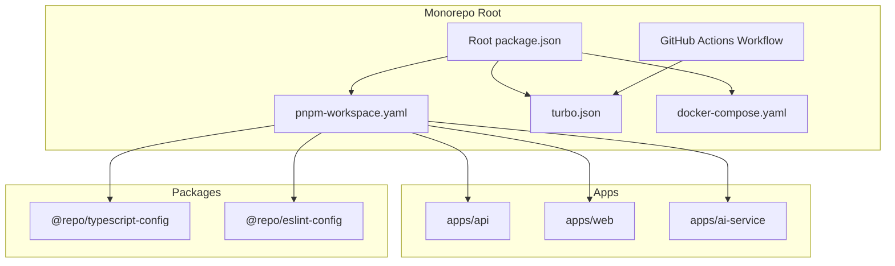
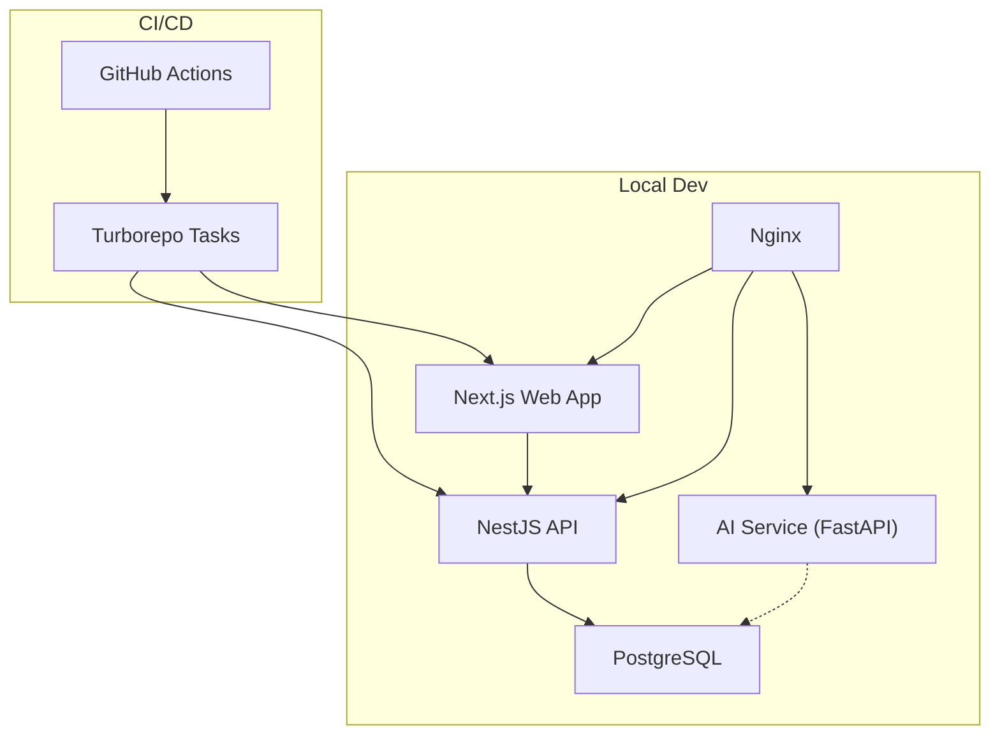
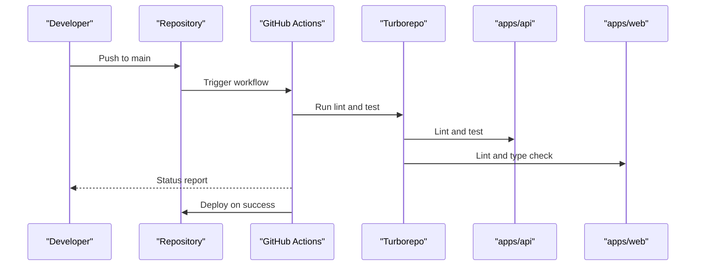
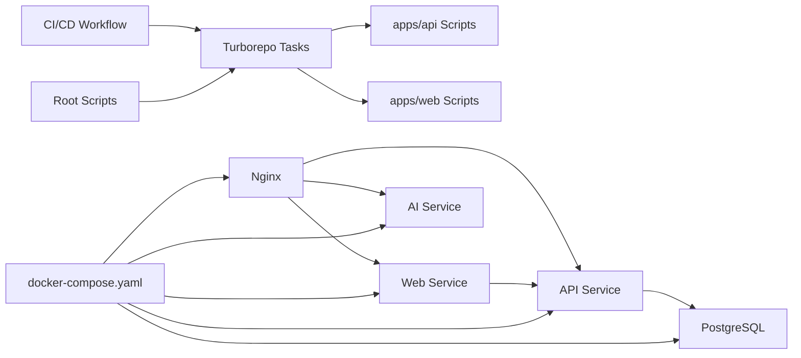

# Development Guidelines

<cite>
**Referenced Files in This Document**
- [package.json](file://package.json)
- [pnpm-workspace.yaml](file://pnpm-workspace.yaml)
- [turbo.json](file://turbo.json)
- [.github/workflows/ci-cd.yaml](file://.github/workflows/ci-cd.yaml)
- [docker-compose.yaml](file://docker-compose.yaml)
- [apps/api/package.json](file://apps/api/package.json)
- [apps/api/tsconfig.json](file://apps/api/tsconfig.json)
- [apps/api/eslint.config.mjs](file://apps/api/eslint.config.mjs)
- [apps/api/.prettierrc](file://apps/api/.prettierrc)
- [apps/web/package.json](file://apps/web/package.json)
- [apps/web/tsconfig.json](file://apps/web/tsconfig.json)
- [apps/web/eslint.config.js](file://apps/web/eslint.config.js)
- [packages/typescript-config/nextjs.json](file://packages/typescript-config/nextjs.json)
- [apps/ai-service/pyproject.toml](file://apps/ai-service/pyproject.toml)
</cite>

## Table of Contents
1. [Introduction](#introduction)
2. [Project Structure](#project-structure)
3. [Core Components](#core-components)
4. [Architecture Overview](#architecture-overview)
5. [Detailed Component Analysis](#detailed-component-analysis)
6. [Dependency Analysis](#dependency-analysis)
7. [Performance Considerations](#performance-considerations)
8. [Troubleshooting Guide](#troubleshooting-guide)
9. [Conclusion](#conclusion)
10. [Appendices](#appendices)

## Introduction
This document defines comprehensive development guidelines for contributors working on the hackathon project. It covers code style and conventions, contribution workflows, development environment setup, and troubleshooting procedures. It also documents the TypeScript configuration, ESLint rules, Prettier formatting standards, and code quality practices across the monorepo managed with pnpm workspaces and Turborepo. Finally, it outlines the Git workflow, branch management, and pull request procedures aligned with the existing CI/CD pipeline.

## Project Structure
The project is a monorepo organized with pnpm workspaces and Turborepo. It includes:
- apps/api: NestJS backend with Prisma ORM and authentication modules
- apps/web: Next.js frontend using React 19 and Radix UI primitives
- apps/ai-service: Python FastAPI microservice
- packages: Shared configuration packages for TypeScript and ESLint
- Root scripts and CI/CD pipeline orchestrated via Turbo and GitHub Actions

**Diagram sources**
- [package.json:1-21](file://package.json#L1-L21)
- [pnpm-workspace.yaml:1-4](file://pnpm-workspace.yaml#L1-L4)
- [turbo.json:1-22](file://turbo.json#L1-L22)
- [docker-compose.yaml:1-83](file://docker-compose.yaml#L1-L83)
- [.github/workflows/ci-cd.yaml:1-81](file://.github/workflows/ci-cd.yaml#L1-L81)

**Section sources**
- [package.json:1-21](file://package.json#L1-L21)
- [pnpm-workspace.yaml:1-4](file://pnpm-workspace.yaml#L1-L4)
- [turbo.json:1-22](file://turbo.json#L1-L22)
- [docker-compose.yaml:1-83](file://docker-compose.yaml#L1-L83)
- [.github/workflows/ci-cd.yaml:1-81](file://.github/workflows/ci-cd.yaml#L1-L81)

## Core Components
This section documents the foundational tooling and configuration that define code quality and developer experience across the stack.

- Node.js and Package Manager
  - Root enforces Node.js >= 18 and uses pnpm 9.x as the package manager.
  - The API app pins Node.js >= 22.0.0 for stricter runtime compatibility.
  - Scripts at the root delegate to Turborepo tasks for build, dev, lint, format, and type checking.

- TypeScript Configuration
  - apps/api uses a strict tsconfig targeting ES2023 with nodenext module resolution and decorators enabled.
  - apps/web extends @repo/typescript-config/nextjs.json, enabling Next.js plugin, JSX handling, and strict null checks.
  - packages/typescript-config/nextjs.json sets module resolution for bundler, JSX preserve mode, and no emit for Next.js.

- ESLint and Formatting
  - apps/api uses a modern ESLint flat config with TypeScript ESLint recommended rules, Jest globals, and Prettier integration.
  - apps/web references @repo/eslint-config/next-js exported configuration.
  - Prettier is configured in apps/api with single quotes and trailing commas.

- Python AI Service
  - apps/ai-service uses pyproject.toml with FastAPI and Uvicorn pinned for reproducibility.

**Section sources**
- [package.json:1-21](file://package.json#L1-L21)
- [apps/api/package.json:1-120](file://apps/api/package.json#L1-L120)
- [apps/api/tsconfig.json:1-26](file://apps/api/tsconfig.json#L1-L26)
- [apps/web/tsconfig.json:1-21](file://apps/web/tsconfig.json#L1-L21)
- [packages/typescript-config/nextjs.json:1-13](file://packages/typescript-config/nextjs.json#L1-L13)
- [apps/api/eslint.config.mjs:1-36](file://apps/api/eslint.config.mjs#L1-L36)
- [apps/web/eslint.config.js:1-5](file://apps/web/eslint.config.js#L1-L5)
- [apps/api/.prettierrc:1-5](file://apps/api/.prettierrc#L1-L5)
- [apps/ai-service/pyproject.toml:1-11](file://apps/ai-service/pyproject.toml#L1-L11)

## Architecture Overview
The development environment is orchestrated through Docker Compose to run the database, API, AI service, web frontend, and Nginx reverse proxy. The CI/CD pipeline automates linting, testing, and deployment on push to main.

**Diagram sources**
- [docker-compose.yaml:1-83](file://docker-compose.yaml#L1-L83)
- [.github/workflows/ci-cd.yaml:1-81](file://.github/workflows/ci-cd.yaml#L1-L81)

## Detailed Component Analysis

### Code Style and Conventions

- TypeScript Standards
  - apps/api
    - Targets ES2023 with nodenext modules and explicit metadata/decorators for NestJS.
    - Strict null checks enabled; incremental builds and source maps for debugging.
  - apps/web
    - Extends shared Next.js configuration with JSX preserve and no emit for type generation.
    - Path aliases (@/*) configured for cleaner imports.

- ESLint and Prettier
  - apps/api
    - Flat config enables TypeScript ESLint recommended rules, type-checked rules, and Prettier recommended plugin.
    - Globals include Node and Jest environments; parser options enable project service with tsconfig root detection.
    - Rules include disabling explicit any, warning on floating promises and unsafe arguments, and enforcing Prettier with end-of-line auto.
  - apps/web
    - Uses @repo/eslint-config/next-js exported configuration for Next.js projects.
  - Prettier
    - Single quotes and trailing commas enforced in apps/api.

- Naming and Import Conventions
  - Prefer explicit file extensions for imports when required by tooling.
  - Use domain-driven module names under apps/api/modules (e.g., auth, users) for clarity.

**Section sources**
- [apps/api/tsconfig.json:1-26](file://apps/api/tsconfig.json#L1-L26)
- [apps/web/tsconfig.json:1-21](file://apps/web/tsconfig.json#L1-L21)
- [packages/typescript-config/nextjs.json:1-13](file://packages/typescript-config/nextjs.json#L1-L13)
- [apps/api/eslint.config.mjs:1-36](file://apps/api/eslint.config.mjs#L1-L36)
- [apps/web/eslint.config.js:1-5](file://apps/web/eslint.config.js#L1-L5)
- [apps/api/.prettierrc:1-5](file://apps/api/.prettierrc#L1-L5)

### Contribution Guidelines

- Branch Management
  - Feature branches: develop new features from main and merge via pull requests.
  - Hotfix branches: short-lived branches for urgent production fixes.
  - Naming: use present-tense imperative style (e.g., add-auth-guard).

- Pull Request Procedures
  - Open PRs against main with a clear description and checklist of changes.
  - Ensure all CI checks pass locally before opening PRs.
  - Keep PRs focused and small for easier review.

- Commit Messages
  - Use imperative mood and concise descriptions.
  - Reference related issues or PRs for traceability.

- Review Process
  - Assign reviewers based on affected modules.
  - Address comments promptly and update PRs accordingly.

[No sources needed since this section provides general guidance]

### Development Workflow

- Local Setup
  - Install dependencies: pnpm install
  - Start services: docker compose up
  - Run dev servers per app:
    - API: pnpm --filter api dev
    - Web: pnpm --filter web dev
    - AI Service: uv pip install -r apps/ai-service/requirements.txt; uv run apps/ai-service/main.py

- Running Tasks
  - Build: pnpm build
  - Lint: pnpm lint
  - Type check: pnpm check-types
  - Format: pnpm format

- CI/CD
  - The pipeline installs pnpm 9, Node.js 20, and Python 3.11, then runs lint and tests via Turborepo.
  - On successful tests, it deploys by pulling latest main, applying Prisma migrations, rebuilding containers, and pruning unused images.

**Diagram sources**
- [.github/workflows/ci-cd.yaml:1-81](file://.github/workflows/ci-cd.yaml#L1-L81)
- [turbo.json:1-22](file://turbo.json#L1-L22)

**Section sources**
- [package.json:1-21](file://package.json#L1-L21)
- [.github/workflows/ci-cd.yaml:1-81](file://.github/workflows/ci-cd.yaml#L1-L81)
- [turbo.json:1-22](file://turbo.json#L1-L22)

### Code Quality Practices

- Linting
  - apps/api: Use ESLint flat config with TypeScript and Prettier integration; fix on run.
  - apps/web: Use shared Next.js ESLint configuration with max warnings enforcement.

- Formatting
  - apps/api: Prettier configured with single quotes and trailing commas; format command targets src and test.

- Type Checking
  - apps/api: tsconfig enables strict null checks and metadata for decorators.
  - apps/web: Next typegen and tsc with no emit for type validation.

- Testing
  - apps/api: Jest configuration with ts-jest transform, module name mapping, coverage collection, and watch modes.
  - apps/web: No dedicated test scripts in package.json; rely on shared lint/type checks.

**Section sources**
- [apps/api/eslint.config.mjs:1-36](file://apps/api/eslint.config.mjs#L1-L36)
- [apps/web/eslint.config.js:1-5](file://apps/web/eslint.config.js#L1-L5)
- [apps/api/.prettierrc:1-5](file://apps/api/.prettierrc#L1-L5)
- [apps/api/tsconfig.json:1-26](file://apps/api/tsconfig.json#L1-L26)
- [apps/web/tsconfig.json:1-21](file://apps/web/tsconfig.json#L1-L21)
- [apps/api/package.json:1-120](file://apps/api/package.json#L1-L120)

### Troubleshooting Guides

- Docker and Services
  - Database readiness: Ensure PostgreSQL healthcheck passes before starting dependent services.
  - Port conflicts: Verify ports 3000–3003, 5432, and 8000 are free or adjust docker-compose ports.
  - Environment variables: Confirm .env files exist for each service and match keys expected by the app.

- API Application
  - Prisma migrations: Apply migrations after pulling changes; ensure DATABASE_URL points to the running db service.
  - Debugging: Use pnpm --filter api debug to attach a debugger; leverage test:debug for Jest with inspect-brk.
  - Decorators and metadata: If encountering reflection issues, confirm emitDecoratorMetadata and experimentalDecorators are enabled.

- Web Application
  - Next.js typegen: Run next typegen and tsc --noEmit to validate types; ensure shared packages are built.
  - Dev server port: The web app runs on port 3003; change via script if needed.

- AI Service
  - Python dependencies: Install requirements using uv pip; ensure FastAPI/Uvicorn versions meet pyproject.toml.
  - API key external: Set API_KEY_EXTERNAL if the service requires external API access.

- CI/CD Failures
  - Node/pnpm versions: Align local versions with GitHub Actions (Node 20, pnpm 9).
  - Python ecosystem: Ensure uv is installed and Python 3.11 is used for dependencies.
  - Caching: Clear caches locally if lockfiles drift; use frozen-lockfile in CI.

**Section sources**
- [docker-compose.yaml:1-83](file://docker-compose.yaml#L1-L83)
- [apps/api/package.json:1-120](file://apps/api/package.json#L1-L120)
- [apps/api/tsconfig.json:1-26](file://apps/api/tsconfig.json#L1-L26)
- [apps/web/package.json:1-52](file://apps/web/package.json#L1-L52)
- [apps/ai-service/pyproject.toml:1-11](file://apps/ai-service/pyproject.toml#L1-L11)
- [.github/workflows/ci-cd.yaml:1-81](file://.github/workflows/ci-cd.yaml#L1-L81)

## Dependency Analysis
This section maps the relationships among scripts, tasks, and services that impact development workflows.

**Diagram sources**
- [package.json:1-21](file://package.json#L1-L21)
- [turbo.json:1-22](file://turbo.json#L1-L22)
- [docker-compose.yaml:1-83](file://docker-compose.yaml#L1-L83)
- [.github/workflows/ci-cd.yaml:1-81](file://.github/workflows/ci-cd.yaml#L1-L81)

**Section sources**
- [package.json:1-21](file://package.json#L1-L21)
- [turbo.json:1-22](file://turbo.json#L1-L22)
- [docker-compose.yaml:1-83](file://docker-compose.yaml#L1-L83)
- [.github/workflows/ci-cd.yaml:1-81](file://.github/workflows/ci-cd.yaml#L1-L81)

## Performance Considerations
- Use Turborepo caching to speed up repeated builds and linting across apps.
- Keep incremental TypeScript builds enabled to reduce rebuild times.
- Prefer watch modes during development to avoid full rebuilds.
- Minimize unnecessary Docker rebuilds by grouping related changes and using selective up commands.

[No sources needed since this section provides general guidance]

## Troubleshooting Guide
Common issues and resolutions:
- Lint failures in apps/web: Ensure @repo/eslint-config is built and up to date; run pnpm install at root.
- Prettier conflicts: Run pnpm format at root to normalize formatting across supported files.
- Type errors in shared packages: Rebuild shared packages and rerun type checks.
- Docker healthchecks failing: Verify credentials and database schema initialization; check logs for startup errors.
- API auth issues: Confirm JWT secret and Google OAuth environment variables are set consistently across services.

**Section sources**
- [package.json:1-21](file://package.json#L1-L21)
- [apps/web/eslint.config.js:1-5](file://apps/web/eslint.config.js#L1-L5)
- [apps/api/.prettierrc:1-5](file://apps/api/.prettierrc#L1-L5)
- [docker-compose.yaml:1-83](file://docker-compose.yaml#L1-L83)

## Conclusion
These guidelines establish a consistent development experience across the monorepo. By adhering to the documented TypeScript, ESLint, and Prettier standards, following the Git workflow, and leveraging the provided troubleshooting procedures, contributors can maintain high code quality and reliable deployments.

[No sources needed since this section summarizes without analyzing specific files]

## Appendices

### Appendix A: Quick Commands Reference
- Install dependencies: pnpm install
- Run all linters: pnpm lint
- Run type checks: pnpm check-types
- Format code: pnpm format
- Start all services: docker compose up
- Start API dev: pnpm --filter api dev
- Start Web dev: pnpm --filter web dev
- Apply Prisma migrations: docker compose exec -T api pnpm --filter api exec prisma migrate deploy

**Section sources**
- [package.json:1-21](file://package.json#L1-L21)
- [docker-compose.yaml:1-83](file://docker-compose.yaml#L1-L83)
- [.github/workflows/ci-cd.yaml:1-81](file://.github/workflows/ci-cd.yaml#L1-L81)