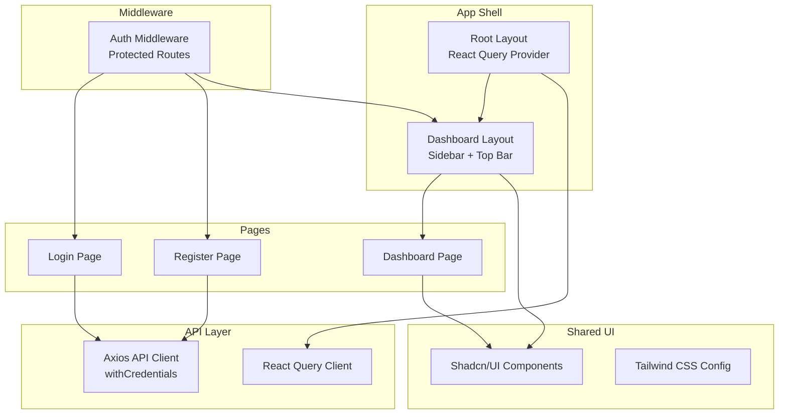
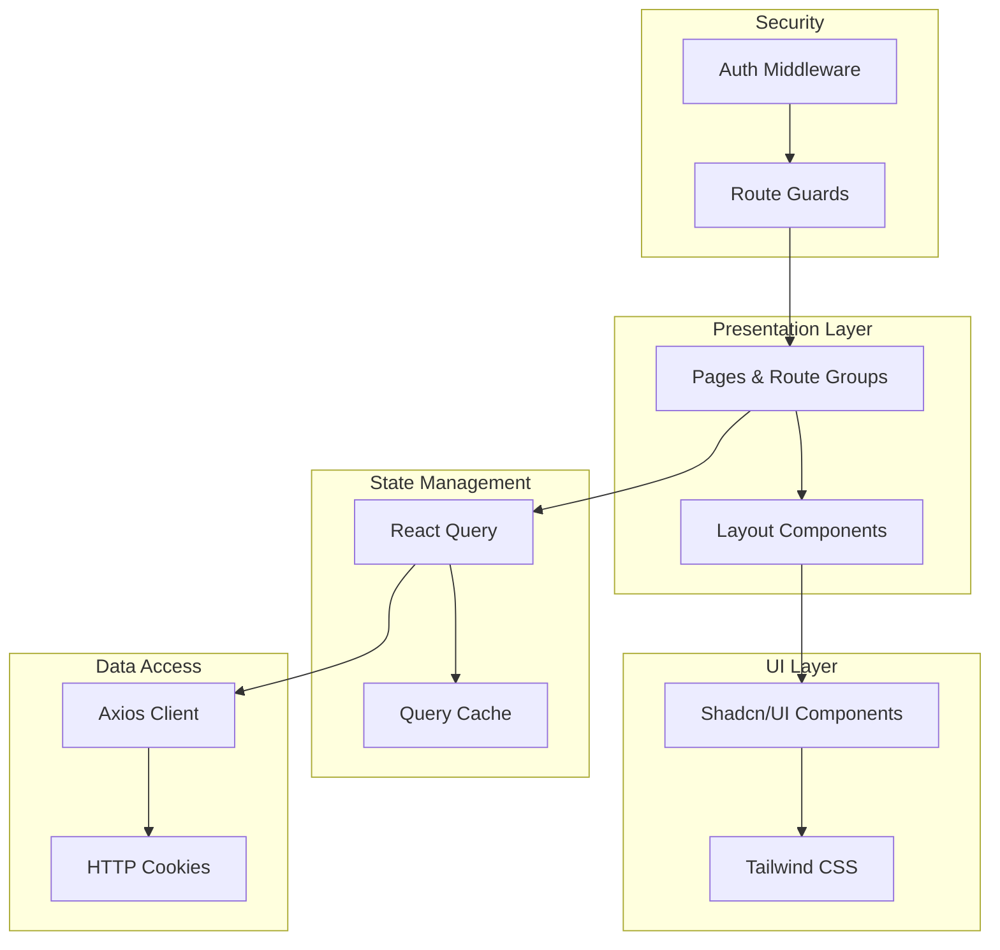
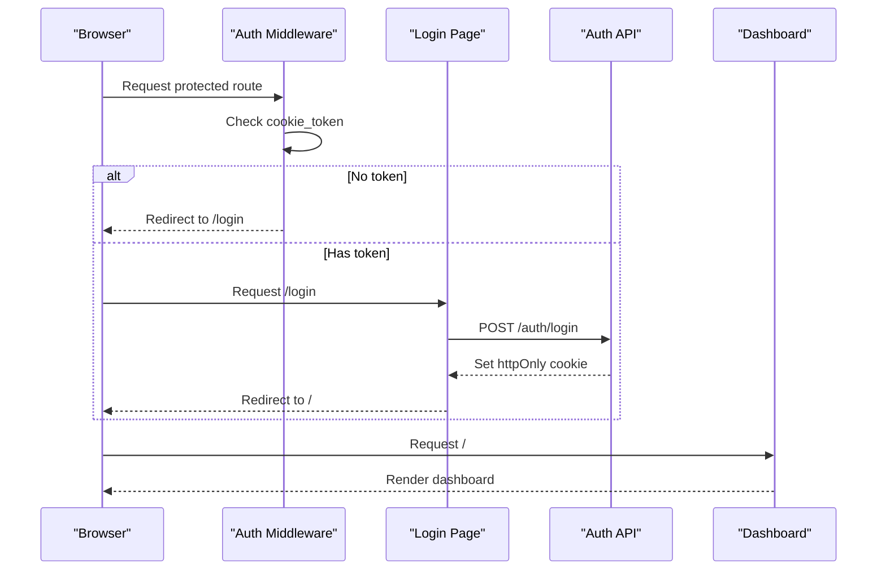
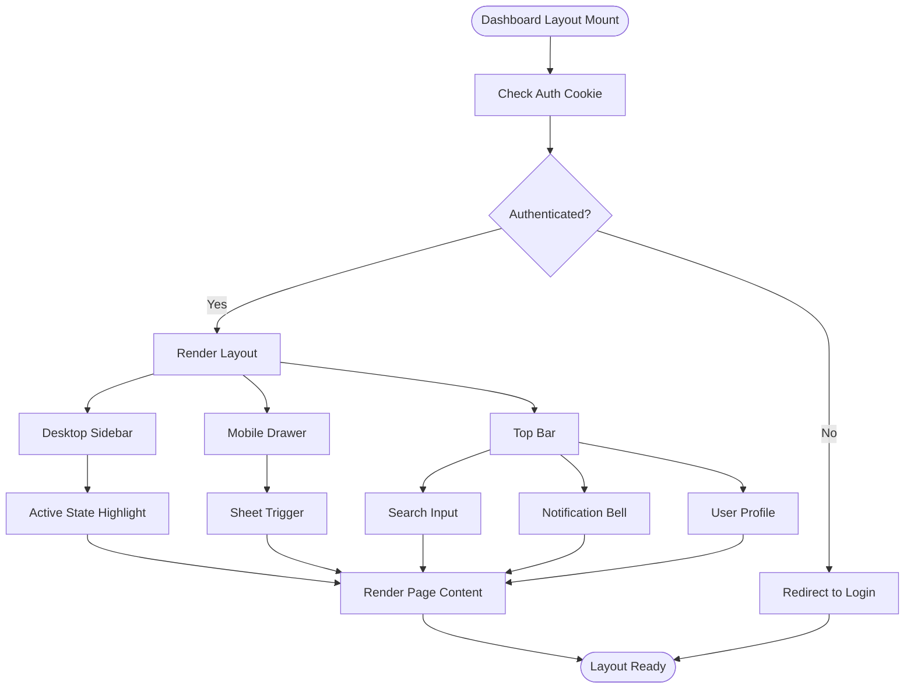
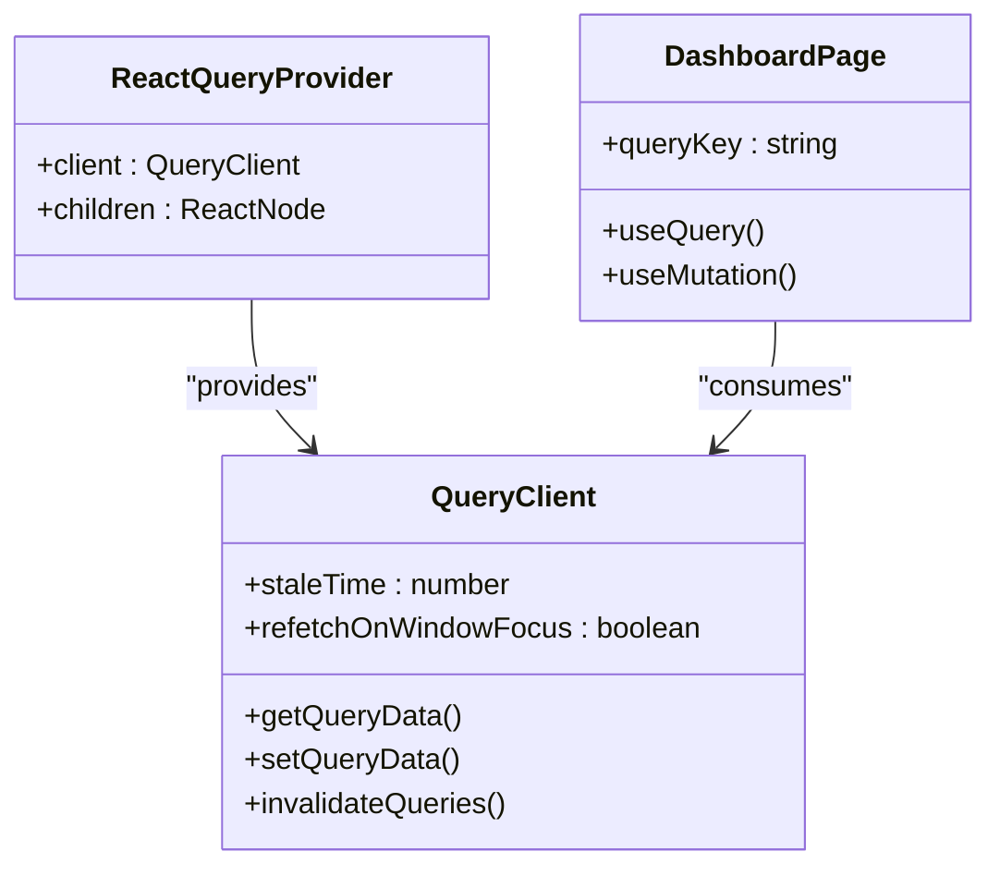
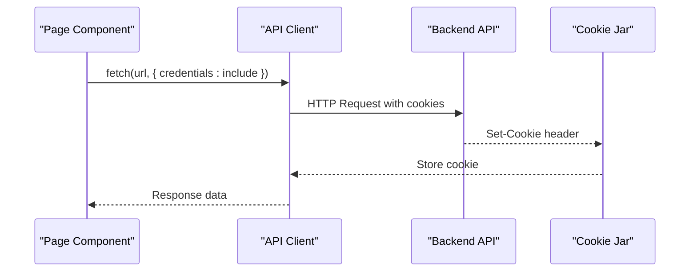
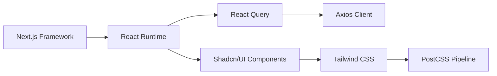

# Frontend Application

<cite>
**Referenced Files in This Document**
- [package.json](file://apps/web/package.json)
- [next.config.js](file://apps/web/next.config.js)
- [middleware.ts](file://apps/web/middleware.ts)
- [lib/react-query.ts](file://apps/web/lib/react-query.ts)
- [lib/api-client.ts](file://apps/web/lib/api-client.ts)
- [app/layout.tsx](file://apps/web/app/layout.tsx)
- [app/(dashboard)/layout.tsx](file://apps/web/app/(dashboard)/layout.tsx)
- [app/(dashboard)/page.tsx](file://apps/web/app/(dashboard)/page.tsx)
- [app/(auth)/login/page.tsx](file://apps/web/app/(auth)/login/page.tsx)
- [app/(auth)/register/page.tsx](file://apps/web/app/(auth)/register/page.tsx)
- [components.json](file://apps/web/components.json)
- [tailwind.config.js](file://apps/web/tailwind.config.js)
- [postcss.config.js](file://apps/web/postcss.config.js)
- [lib/utils.ts](file://apps/web/lib/utils.ts)
</cite>

## Table of Contents
1. [Introduction](#introduction)
2. [Project Structure](#project-structure)
3. [Core Components](#core-components)
4. [Architecture Overview](#architecture-overview)
5. [Detailed Component Analysis](#detailed-component-analysis)
6. [Dependency Analysis](#dependency-analysis)
7. [Performance Considerations](#performance-considerations)
8. [Troubleshooting Guide](#troubleshooting-guide)
9. [Conclusion](#conclusion)

## Introduction
This document provides comprehensive documentation for the Next.js frontend application. It covers the application structure, routing system with protected routes, component architecture, state management using React Query, dashboard layout and navigation, responsive design implementation, middleware configuration, authentication flow integration, API client setup, and the shared UI component library usage with Tailwind CSS styling approach.

## Project Structure
The frontend application is organized as a Next.js app under apps/web. Key areas include:
- Routing with route groups for authentication and dashboard layouts
- Global providers for React Query and notifications
- Shared UI components built with shadcn/ui and styled with Tailwind CSS
- Middleware for authentication protection
- API client configured for server-side cookie-based authentication

**Diagram sources**
- [app/layout.tsx:1-19](file://apps/web/app/layout.tsx#L1-L19)
- [app/(dashboard)/layout.tsx](file://apps/web/app/(dashboard)/layout.tsx#L1-L231)
- [app/(auth)/login/page.tsx](file://apps/web/app/(auth)/login/page.tsx#L1-L254)
- [app/(auth)/register/page.tsx](file://apps/web/app/(auth)/register/page.tsx#L1-L303)
- [middleware.ts:1-25](file://apps/web/middleware.ts#L1-L25)
- [lib/api-client.ts:1-12](file://apps/web/lib/api-client.ts#L1-L12)
- [lib/react-query.ts:1-10](file://apps/web/lib/react-query.ts#L1-L10)

**Section sources**
- [package.json:1-52](file://apps/web/package.json#L1-L52)
- [next.config.js:1-7](file://apps/web/next.config.js#L1-L7)
- [components.json:1-23](file://apps/web/components.json#L1-L23)

## Core Components
This section outlines the primary building blocks of the application.

- Root Layout and Providers
  - Wraps the entire application with React Query provider and global notifications
  - Sets up the HTML document structure and locale
  - Provides centralized configuration for caching and query behavior

- Dashboard Layout
  - Implements a responsive sidebar navigation with active state indicators
  - Includes mobile-responsive drawer using sheets
  - Features top bar with search, notifications, and user profile
  - Manages logout flow via server endpoint

- Authentication Pages
  - Login page with form validation, password visibility toggle, and social login option
  - Registration page with role selection, terms agreement, and form validation
  - Both pages use server-side cookies for authentication persistence

- Shared UI Components
  - Built with shadcn/ui, leveraging Radix UI primitives
  - Styled with Tailwind CSS using a consistent design system
  - Utilities for conditional class merging and component composition

- Middleware Protection
  - Enforces authentication by checking for presence of auth cookies
  - Redirects unauthenticated users away from protected routes
  - Prevents authenticated users from accessing login/register pages

- API Client and State Management
  - Axios-based client configured with credentials for cookie handling
  - React Query client with optimized cache behavior for data freshness
  - Centralized error handling and loading states through UI feedback

**Section sources**
- [app/layout.tsx:1-19](file://apps/web/app/layout.tsx#L1-L19)
- [app/(dashboard)/layout.tsx](file://apps/web/app/(dashboard)/layout.tsx#L1-L231)
- [app/(auth)/login/page.tsx](file://apps/web/app/(auth)/login/page.tsx#L1-L254)
- [app/(auth)/register/page.tsx](file://apps/web/app/(auth)/register/page.tsx#L1-L303)
- [middleware.ts:1-25](file://apps/web/middleware.ts#L1-L25)
- [lib/api-client.ts:1-12](file://apps/web/lib/api-client.ts#L1-L12)
- [lib/react-query.ts:1-10](file://apps/web/lib/react-query.ts#L1-L10)

## Architecture Overview
The application follows a layered architecture:
- Presentation Layer: Next.js app directory with route groups and page components
- UI Layer: Shadcn/UI components integrated with Tailwind CSS
- State Management: React Query for caching, invalidation, and optimistic updates
- Data Access: Axios client configured for server-side cookie-based authentication
- Security: Middleware enforcing authentication and authorization policies
- Styling: Tailwind CSS with CSS variables and utility-first approach

**Diagram sources**
- [app/(dashboard)/layout.tsx](file://apps/web/app/(dashboard)/layout.tsx#L1-L231)
- [app/(auth)/login/page.tsx](file://apps/web/app/(auth)/login/page.tsx#L1-L254)
- [lib/react-query.ts:1-10](file://apps/web/lib/react-query.ts#L1-L10)
- [lib/api-client.ts:1-12](file://apps/web/lib/api-client.ts#L1-L12)
- [middleware.ts:1-25](file://apps/web/middleware.ts#L1-L25)

## Detailed Component Analysis

### Authentication Flow and Middleware
The authentication system uses HTTP-only cookies managed server-side:
- Middleware checks for cookie_token existence
- Redirects unauthenticated users to login
- Prevents authenticated users from accessing auth pages
- Uses path-based matching for protected routes

**Diagram sources**
- [middleware.ts:1-25](file://apps/web/middleware.ts#L1-L25)
- [app/(auth)/login/page.tsx](file://apps/web/app/(auth)/login/page.tsx#L1-L254)

**Section sources**
- [middleware.ts:1-25](file://apps/web/middleware.ts#L1-L25)
- [app/(auth)/login/page.tsx](file://apps/web/app/(auth)/login/page.tsx#L1-L254)
- [app/(auth)/register/page.tsx](file://apps/web/app/(auth)/register/page.tsx#L1-L303)

### Dashboard Layout and Navigation
The dashboard implements a responsive navigation system:
- Desktop sidebar with active state highlighting
- Mobile-responsive drawer with sheet component
- Top bar featuring search, notifications, and user profile
- Dynamic breadcrumb based on current route
- Logout functionality via server endpoint

**Diagram sources**
- [app/(dashboard)/layout.tsx](file://apps/web/app/(dashboard)/layout.tsx#L1-L231)

**Section sources**
- [app/(dashboard)/layout.tsx](file://apps/web/app/(dashboard)/layout.tsx#L1-L231)

### State Management with React Query
React Query is configured with:
- Centralized query client instance
- Stale time of 5 minutes for optimal performance
- Disabled window focus refetch to reduce network requests
- Global provider in root layout

**Diagram sources**
- [lib/react-query.ts:1-10](file://apps/web/lib/react-query.ts#L1-L10)
- [app/layout.tsx:1-19](file://apps/web/app/layout.tsx#L1-L19)

**Section sources**
- [lib/react-query.ts:1-10](file://apps/web/lib/react-query.ts#L1-L10)
- [app/layout.tsx:1-19](file://apps/web/app/layout.tsx#L1-L19)

### API Client Setup
The API client is configured for server-side cookie authentication:
- Base URL from environment variable
- JSON content type headers
- Credentials enabled for cookie transmission
- No manual token management in interceptors

**Diagram sources**
- [lib/api-client.ts:1-12](file://apps/web/lib/api-client.ts#L1-L12)

**Section sources**
- [lib/api-client.ts:1-12](file://apps/web/lib/api-client.ts#L1-L12)

### Responsive Design Implementation
The application uses a mobile-first approach with Tailwind CSS:
- Breakpoints for mobile, tablet, and desktop
- Flexible grid layouts for statistics and charts
- Responsive typography and spacing
- Mobile drawer for navigation on small screens
- Adaptive card layouts and component sizing

**Section sources**
- [app/(dashboard)/layout.tsx](file://apps/web/app/(dashboard)/layout.tsx#L1-L231)
- [tailwind.config.js:1-60](file://apps/web/tailwind.config.js#L1-L60)
- [lib/utils.ts:1-7](file://apps/web/lib/utils.ts#L1-L7)

### Shared UI Component Library
The application leverages shadcn/ui components:
- Consistent design system across all pages
- Utility functions for conditional class merging
- Theme integration with CSS variables
- Accessible component primitives from Radix UI

**Section sources**
- [components.json:1-23](file://apps/web/components.json#L1-L23)
- [lib/utils.ts:1-7](file://apps/web/lib/utils.ts#L1-L7)

## Dependency Analysis
The application has the following key dependencies:
- Next.js 16.2.0 for framework and routing
- React 19.2.0 and React DOM for rendering
- @tanstack/react-query 5.101.0 for state management
- Axios 1.18.0 for HTTP client
- Tailwind CSS with shadcn/ui for styling
- Radix UI primitives for accessible components

**Diagram sources**
- [package.json:1-52](file://apps/web/package.json#L1-L52)

**Section sources**
- [package.json:1-52](file://apps/web/package.json#L1-L52)

## Performance Considerations
- React Query caching reduces redundant network requests
- Disabled window focus refetch prevents unnecessary background updates
- HTTP-only cookies eliminate client-side token storage overhead
- Tailwind CSS utility classes minimize CSS bundle size
- Component-based architecture enables efficient re-rendering

## Troubleshooting Guide
Common issues and solutions:
- Authentication failures: Verify cookie_token presence and server-side session validity
- API connectivity: Check NEXT_PUBLIC_API_URL environment variable and CORS configuration
- Styling inconsistencies: Ensure Tailwind CSS is properly configured and compiled
- Component rendering: Verify shadcn/ui installation and component aliases
- Middleware redirects: Confirm matcher configuration and route group structure

**Section sources**
- [middleware.ts:1-25](file://apps/web/middleware.ts#L1-L25)
- [lib/api-client.ts:1-12](file://apps/web/lib/api-client.ts#L1-L12)
- [tailwind.config.js:1-60](file://apps/web/tailwind.config.js#L1-L60)

## Conclusion
The Next.js frontend application implements a robust, scalable architecture with strong separation of concerns. The combination of route groups, middleware protection, React Query state management, and shadcn/ui components creates a maintainable and performant user interface. The HTTP-only cookie-based authentication ensures secure session management while the responsive design provides an excellent user experience across devices.