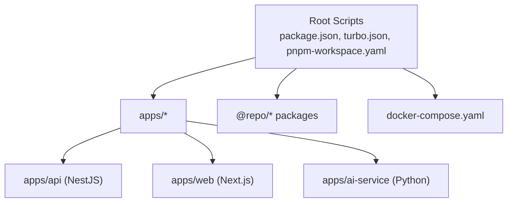
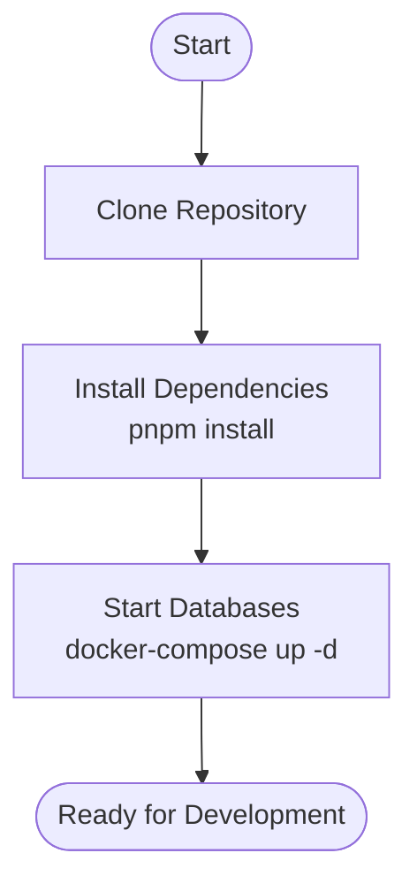
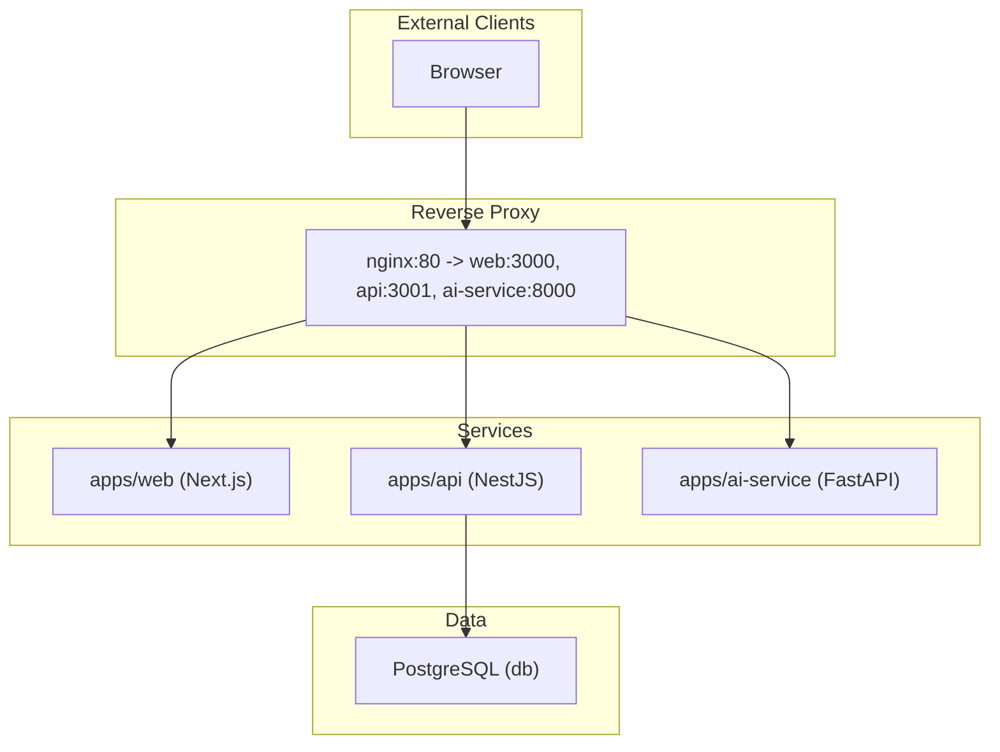

# Getting Started

<cite>
**Referenced Files in This Document**
- [README.md](file://README.md)
- [package.json](file://package.json)
- [pnpm-workspace.yaml](file://pnpm-workspace.yaml)
- [turbo.json](file://turbo.json)
- [docker-compose.yaml](file://docker-compose.yaml)
- [apps/api/package.json](file://apps/api/package.json)
- [apps/api/Dockerfile](file://apps/api/Dockerfile)
- [apps/api/src/main.ts](file://apps/api/src/main.ts)
- [apps/api/prisma/schema.prisma](file://apps/api/prisma/schema.prisma)
- [apps/web/package.json](file://apps/web/package.json)
- [apps/web/Dockerfile](file://apps/web/Dockerfile)
- [apps/web/next.config.js](file://apps/web/next.config.js)
- [apps/web/app/layout.tsx](file://apps/web/app/layout.tsx)
- [apps/ai-service/Dockerfile](file://apps/ai-service/Dockerfile)
</cite>

## Table of Contents
1. [Introduction](#introduction)
2. [Project Structure](#project-structure)
3. [System Prerequisites](#system-prerequisites)
4. [Installation Steps](#installation-steps)
5. [Environment Setup](#environment-setup)
6. [Local Development Workflow](#local-development-workflow)
7. [Turborepo and pnpm Filtering](#turborepo-and-pnpm-filtering)
8. [Architecture Overview](#architecture-overview)
9. [Troubleshooting Guide](#troubleshooting-guide)
10. [Conclusion](#conclusion)

## Introduction
This guide helps you set up and run the AgriNexus hackathon project locally. It covers prerequisites, installation, environment configuration, and both full-stack and selective service development modes powered by Turborepo and pnpm workspaces.

## Project Structure
The project is a monorepo organized with:
- apps: Full-stack applications (NestJS API, Next.js web app, Python AI service)
- packages: Shared libraries and configs (namespaced under @repo/*)
- Root scripts and tooling: Turborepo, pnpm, Docker Compose

**Diagram sources**
- [package.json:1-21](file://package.json#L1-L21)
- [pnpm-workspace.yaml:1-4](file://pnpm-workspace.yaml#L1-L4)
- [turbo.json:1-22](file://turbo.json#L1-L22)
- [docker-compose.yaml:1-83](file://docker-compose.yaml#L1-L83)

**Section sources**
- [package.json:1-21](file://package.json#L1-L21)
- [pnpm-workspace.yaml:1-4](file://pnpm-workspace.yaml#L1-L4)
- [turbo.json:1-22](file://turbo.json#L1-L22)

## System Prerequisites
- Node.js: v18 or newer (required by root engines; NestJS app requires v22+)
- pnpm: Package manager installed globally
- Docker and Docker Compose: Required to run databases and services locally

**Section sources**
- [README.md:5-7](file://README.md#L5-L7)
- [package.json:17-19](file://package.json#L17-L19)
- [apps/api/package.json:8-10](file://apps/api/package.json#L8-L10)

## Installation Steps
1) Clone the repository (if not already cloned)
2) Install dependencies at the repository root using pnpm
3) Start the database infrastructure with Docker Compose

**Diagram sources**
- [README.md:13-31](file://README.md#L13-L31)
- [package.json:4-9](file://package.json#L4-L9)

**Section sources**
- [README.md:13-31](file://README.md#L13-L31)
- [package.json:4-9](file://package.json#L4-L9)

## Environment Setup
- Database container: PostgreSQL with PostGIS support
- API service: NestJS application connecting to the database
- Web application: Next.js frontend
- AI service: Python FastAPI service
- Nginx: Reverse proxy routing traffic to the above services

Ports and defaults:
- API: http://localhost:3001/api
- Web: http://localhost:3003
- AI Service: http://localhost:8000
- Nginx: http://localhost

Compose services and dependencies:
- api depends on db being healthy
- web depends on api
- nginx depends on web, api, and ai-service

**Section sources**
- [docker-compose.yaml:1-83](file://docker-compose.yaml#L1-L83)
- [apps/api/src/main.ts:12-16](file://apps/api/src/main.ts#L12-L16)

## Local Development Workflow
Choose one of the following approaches:

Option A: Run all services together
- Use the root script to start all services concurrently via Turborepo

Option B: Run a single service
- Use pnpm filter to target a specific app (e.g., api or web)

Notes:
- The API app sets a global prefix for routes and enables CORS based on environment variables.
- The web app runs on port 3003 and uses a standalone Next.js output configuration.

**Section sources**
- [README.md:33-65](file://README.md#L33-L65)
- [package.json:4-9](file://package.json#L4-L9)
- [apps/api/src/main.ts:12-20](file://apps/api/src/main.ts#L12-L20)
- [apps/web/package.json:6-12](file://apps/web/package.json#L6-L12)
- [apps/web/next.config.js:1-7](file://apps/web/next.config.js#L1-L7)

## Turborepo and pnpm Filtering
- Root scripts delegate to Turborepo tasks (build, dev, lint, check-types)
- Workspaces are defined for apps and packages
- Selective development is supported via pnpm filter flags

Common commands:
- Full-stack development: pnpm dev
- Single service development:
  - pnpm --filter api dev
  - pnpm --filter web dev

How it works:
- Turborepo orchestrates task execution across workspaces
- pnpm filter narrows execution to a specific app’s scripts

**Section sources**
- [package.json:4-9](file://package.json#L4-L9)
- [pnpm-workspace.yaml:1-4](file://pnpm-workspace.yaml#L1-L4)
- [turbo.json:1-22](file://turbo.json#L1-L22)
- [README.md:47-65](file://README.md#L47-L65)

## Architecture Overview
The development stack consists of:
- Database: PostgreSQL (health-checked)
- Backend API: NestJS with Prisma ORM and Swagger docs
- Frontend: Next.js application
- AI Service: Python FastAPI microservice
- Nginx: Routes requests to the appropriate service

**Diagram sources**
- [docker-compose.yaml:1-83](file://docker-compose.yaml#L1-L83)
- [apps/api/src/main.ts:30-37](file://apps/api/src/main.ts#L30-L37)

## Troubleshooting Guide
- Port conflicts
  - API runs on port 3001; adjust if in use
  - Web runs on port 3003; adjust if in use
  - AI service runs on port 8000; adjust if in use
- CORS issues
  - Verify ALLOWED_ORIGINS and FRONTEND_URL in the API environment
- Database connectivity
  - Confirm the db service is healthy before starting the API
  - Ensure DATABASE_URL matches the db service and schema
- Type checking and linting
  - Use root scripts to run type checks and linters consistently across the monorepo

**Section sources**
- [apps/api/src/main.ts:12-16](file://apps/api/src/main.ts#L12-L16)
- [docker-compose.yaml:13-17](file://docker-compose.yaml#L13-L17)
- [docker-compose.yaml:28-36](file://docker-compose.yaml#L28-L36)
- [package.json:6-9](file://package.json#L6-L9)

## Conclusion
You now have the essentials to set up the AgriNexus project locally, run all services together, or focus on a single service during development. Use the provided scripts and compose configuration to streamline your workflow, and rely on Turborepo and pnpm filtering for efficient iteration.