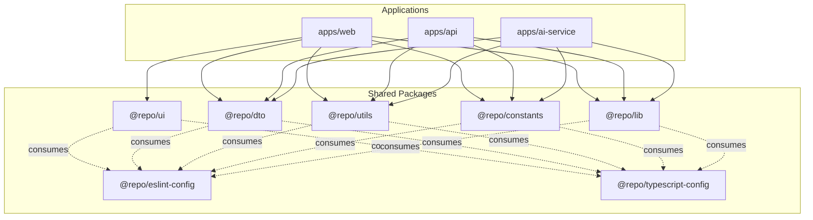
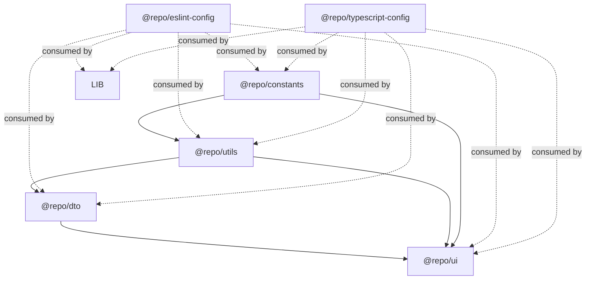
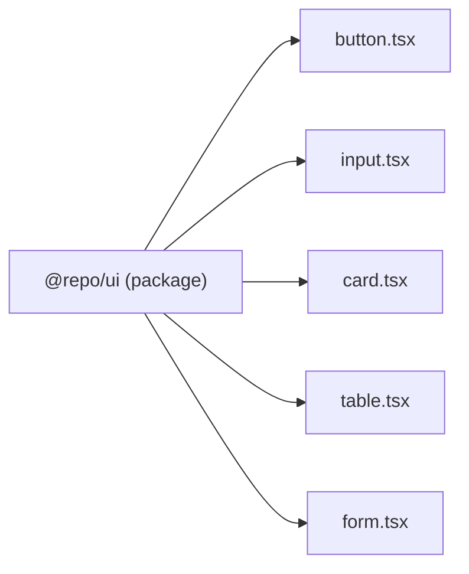
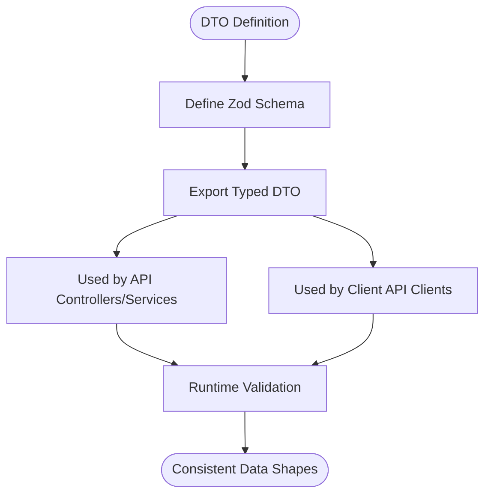
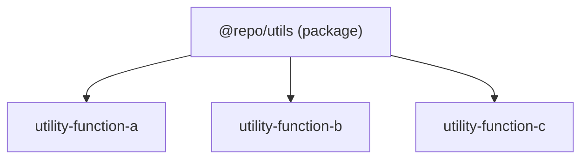
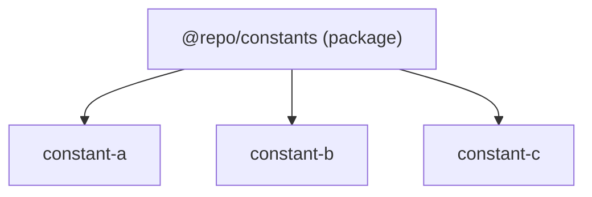
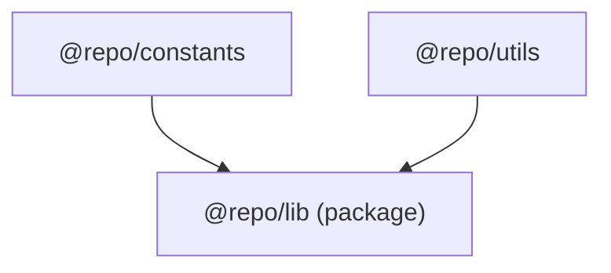
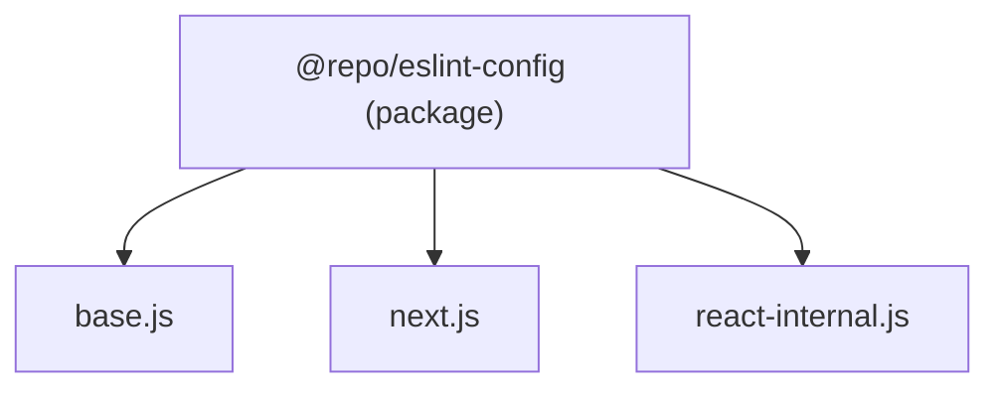
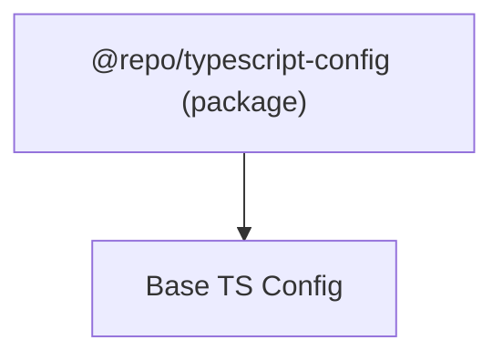
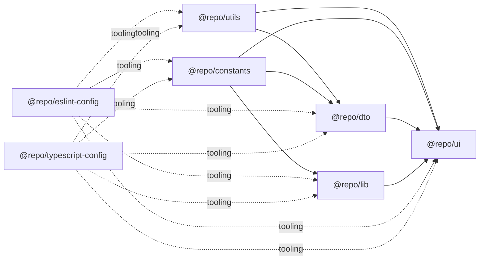

# Shared Packages

<cite>
**Referenced Files in This Document**
- [package.json](file://packages/ui/package.json)
- [package.json](file://packages/dto/package.json)
- [package.json](file://packages/utils/package.json)
- [package.json](file://packages/constants/package.json)
- [package.json](file://packages/lib/package.json)
- [package.json](file://packages/eslint-config/package.json)
- [package.json](file://packages/typescript-config/package.json)
- [README.md](file://README.md)
</cite>

## Table of Contents
1. [Introduction](#introduction)
2. [Project Structure](#project-structure)
3. [Core Components](#core-components)
4. [Architecture Overview](#architecture-overview)
5. [Detailed Component Analysis](#detailed-component-analysis)
6. [Dependency Analysis](#dependency-analysis)
7. [Performance Considerations](#performance-considerations)
8. [Troubleshooting Guide](#troubleshooting-guide)
9. [Conclusion](#conclusion)

## Introduction
This document describes the shared packages ecosystem used across the monorepo. It covers the UI component library, shared DTO schemas, utility functions, constants, and supporting libraries for linting and TypeScript configuration. The goal is to explain the architecture, reusable UI elements, design system implementation, shared DTO patterns, API response formatting conventions, and common utility functions. It also provides usage guidelines, component APIs, and integration patterns for consuming these packages across applications.

## Project Structure
The shared packages live under the packages directory and are organized by domain:
- @repo/ui: React UI component library
- @repo/dto: Shared DTO schemas (validated via Zod)
- @repo/utils: General-purpose utility functions
- @repo/constants: Shared constants
- @repo/lib: Higher-level library built on top of constants and utilities
- @repo/eslint-config: Shared ESLint configurations
- @repo/typescript-config: Shared TypeScript base configuration

**Diagram sources**
- [package.json:1-27](file://packages/ui/package.json#L1-L27)
- [package.json:1-19](file://packages/dto/package.json#L1-L19)
- [package.json:1-27](file://packages/utils/package.json#L1-L27)
- [package.json:1-27](file://packages/constants/package.json#L1-L27)
- [package.json:1-30](file://packages/lib/package.json#L1-L30)
- [package.json:1-25](file://packages/eslint-config/package.json#L1-L25)
- [package.json:1-10](file://packages/typescript-config/package.json#L1-L10)

**Section sources**
- [README.md](file://README.md)
- [package.json:1-27](file://packages/ui/package.json#L1-L27)
- [package.json:1-19](file://packages/dto/package.json#L1-L19)
- [package.json:1-27](file://packages/utils/package.json#L1-L27)
- [package.json:1-27](file://packages/constants/package.json#L1-L27)
- [package.json:1-30](file://packages/lib/package.json#L1-L30)
- [package.json:1-25](file://packages/eslint-config/package.json#L1-L25)
- [package.json:1-10](file://packages/typescript-config/package.json#L1-L10)

## Core Components
This section outlines the purpose and composition of each shared package.

- @repo/ui
  - Purpose: React component library exporting individual components for use across applications.
  - Build and exports: Uses TypeScript and React; exposes all components via export mapping.
  - Scripts: Linting, type checking, and a generator script for new components.
  - Dependencies: React and ReactDOM.

- @repo/dto
  - Purpose: Shared DTO schemas validated with Zod for consistent request/response shapes.
  - Build: Compiles TypeScript to distribution artifacts.
  - Scripts: Build, lint, and type check.
  - Dependencies: Zod.

- @repo/utils
  - Purpose: Utility functions packaged for reuse across applications.
  - Build: Bundled via tsup with dual CJS/ESM outputs and declaration files.
  - Scripts: Build, dev watch, and type check.
  - Dev Dependencies: tsup and TypeScript.

- @repo/constants
  - Purpose: Centralized constants for shared values across the monorepo.
  - Build: Bundled via tsup with dual CJS/ESM outputs and declaration files.
  - Scripts: Build, dev watch, and type check.

- @repo/lib
  - Purpose: Higher-level library depending on constants and utilities.
  - Build: Bundled via tsup with dual CJS/ESM outputs and declaration files.
  - Dependencies: @repo/constants (workspace).
  - Scripts: Build, dev watch, and type check.

- @repo/eslint-config
  - Purpose: Shared ESLint configurations for base JS/TS, Next.js, and internal React rules.
  - Exports: Multiple config entry points for different environments.
  - Dev Dependencies: ESLint ecosystem packages.

- @repo/typescript-config
  - Purpose: Shared TypeScript base configuration published for reuse.
  - Behavior: Publishable configuration package.

**Section sources**
- [package.json:1-27](file://packages/ui/package.json#L1-L27)
- [package.json:1-19](file://packages/dto/package.json#L1-L19)
- [package.json:1-27](file://packages/utils/package.json#L1-L27)
- [package.json:1-27](file://packages/constants/package.json#L1-L27)
- [package.json:1-30](file://packages/lib/package.json#L1-L30)
- [package.json:1-25](file://packages/eslint-config/package.json#L1-L25)
- [package.json:1-10](file://packages/typescript-config/package.json#L1-L10)

## Architecture Overview
The shared packages form a layered architecture:
- Constants define foundational values.
- Utilities build on constants and expose pure functions.
- DTOs depend on utilities and Zod for validation.
- UI composes DTOs and utilities to render consistent experiences.
- Supporting libraries (ESLint and TypeScript configs) standardize development tooling.

**Diagram sources**
- [package.json:1-27](file://packages/constants/package.json#L1-L27)
- [package.json:1-27](file://packages/utils/package.json#L1-L27)
- [package.json:1-19](file://packages/dto/package.json#L1-L19)
- [package.json:1-27](file://packages/ui/package.json#L1-L27)
- [package.json:1-30](file://packages/lib/package.json#L1-L30)
- [package.json:1-25](file://packages/eslint-config/package.json#L1-L25)
- [package.json:1-10](file://packages/typescript-config/package.json#L1-L10)

## Detailed Component Analysis

### UI Component Library (@repo/ui)
- Composition: Individual components exported per file.
- Usage pattern: Applications import specific components by name.
- Tooling: Generator script for scaffolding new components; linting and type checks enforced.
- Integration: Consumed by Next.js web app pages and potentially other React apps.

**Diagram sources**
- [package.json:1-27](file://packages/ui/package.json#L1-L27)

**Section sources**
- [package.json:1-27](file://packages/ui/package.json#L1-L27)

### DTO Schemas (@repo/dto)
- Purpose: Define and validate request/response shapes consistently across services.
- Validation: Built with Zod for runtime safety and developer experience.
- Distribution: Compiled TypeScript outputs for consumption by API and client apps.
- Integration: Used by NestJS controllers/services and client-side API clients.

**Diagram sources**
- [package.json:1-19](file://packages/dto/package.json#L1-L19)

**Section sources**
- [package.json:1-19](file://packages/dto/package.json#L1-L19)

### Utilities (@repo/utils)
- Purpose: Provide reusable functions for common tasks.
- Build: Dual CJS/ESM outputs with TypeScript declarations.
- Consumption: Used by DTOs, UI, and application logic.

**Diagram sources**
- [package.json:1-27](file://packages/utils/package.json#L1-L27)

**Section sources**
- [package.json:1-27](file://packages/utils/package.json#L1-L27)

### Constants (@repo/constants)
- Purpose: Centralize shared values (strings, numeric identifiers, etc.).
- Build: Dual CJS/ESM outputs with TypeScript declarations.
- Consumption: Imported by utilities and higher-level libraries.

**Diagram sources**
- [package.json:1-27](file://packages/constants/package.json#L1-L27)

**Section sources**
- [package.json:1-27](file://packages/constants/package.json#L1-L27)

### Higher-Level Library (@repo/lib)
- Purpose: Compose constants and utilities into cohesive modules for broader use.
- Build: Dual CJS/ESM outputs with TypeScript declarations.
- Dependency: Depends on @repo/constants via workspace.

**Diagram sources**
- [package.json:1-30](file://packages/lib/package.json#L1-L30)

**Section sources**
- [package.json:1-30](file://packages/lib/package.json#L1-L30)

### Linting Config (@repo/eslint-config)
- Purpose: Provide standardized ESLint configurations for base projects, Next.js, and internal React rules.
- Exports: Multiple entry points for different environments.

**Diagram sources**
- [package.json:1-25](file://packages/eslint-config/package.json#L1-L25)

**Section sources**
- [package.json:1-25](file://packages/eslint-config/package.json#L1-L25)

### TypeScript Config (@repo/typescript-config)
- Purpose: Share a base TypeScript configuration across packages and applications.

**Diagram sources**
- [package.json:1-10](file://packages/typescript-config/package.json#L1-L10)

**Section sources**
- [package.json:1-10](file://packages/typescript-config/package.json#L1-L10)

## Dependency Analysis
The packages exhibit a layered dependency model:
- @repo/lib depends on @repo/constants.
- @repo/dto depends on @repo/utils and Zod.
- @repo/ui consumes @repo/dto, @repo/utils, and @repo/constants.
- All packages consume @repo/eslint-config and @repo/typescript-config for tooling consistency.

**Diagram sources**
- [package.json:1-27](file://packages/constants/package.json#L1-L27)
- [package.json:1-27](file://packages/utils/package.json#L1-L27)
- [package.json:1-19](file://packages/dto/package.json#L1-L19)
- [package.json:1-27](file://packages/ui/package.json#L1-L27)
- [package.json:1-30](file://packages/lib/package.json#L1-L30)
- [package.json:1-25](file://packages/eslint-config/package.json#L1-L25)
- [package.json:1-10](file://packages/typescript-config/package.json#L1-L10)

**Section sources**
- [package.json:22-24](file://packages/lib/package.json#L22-L24)
- [package.json:16-18](file://packages/dto/package.json#L16-L18)
- [package.json:22-25](file://packages/ui/package.json#L22-L25)
- [package.json:6-10](file://packages/eslint-config/package.json#L6-L10)
- [package.json:1-10](file://packages/typescript-config/package.json#L1-L10)

## Performance Considerations
- Bundle size: Prefer tree-shaking-friendly ESM builds; ensure consumers import only what they need.
- Validation overhead: Keep Zod validations minimal in hot paths; cache or memoize where appropriate.
- Utilities: Favor pure functions and avoid heavy synchronous computations in frequently called helpers.
- Type generation: Maintain accurate d.ts outputs to prevent unnecessary recompilations.

## Troubleshooting Guide
- Build failures:
  - Verify tsup and TypeScript versions match package expectations.
  - Ensure export conditions align with target environments (CJS vs ESM).
- Lint errors:
  - Confirm ESLint configs are applied consistently across packages.
  - Check plugin compatibility and configuration precedence.
- Runtime validation errors:
  - Review Zod schema definitions and ensure inputs match expected shapes.
  - Add defensive logging around DTO parsing to isolate failures early.

## Conclusion
The shared packages ecosystem provides a cohesive foundation for building consistent, maintainable applications. By centralizing constants, utilities, DTOs, and UI components, teams can reduce duplication, enforce standards, and accelerate development. The layered architecture ensures clear separation of concerns, while standardized linting and TypeScript configurations keep code quality uniform across the monorepo.