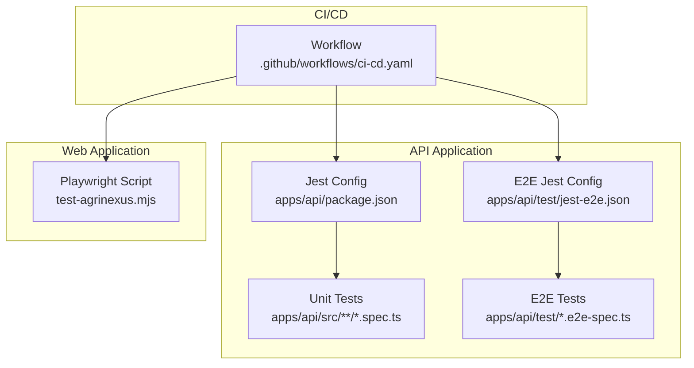
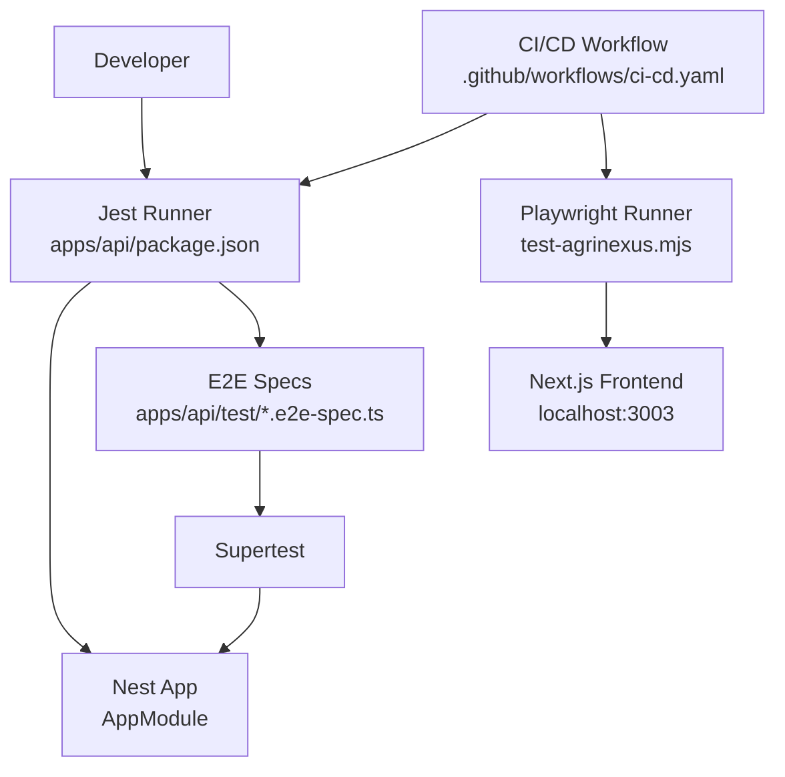
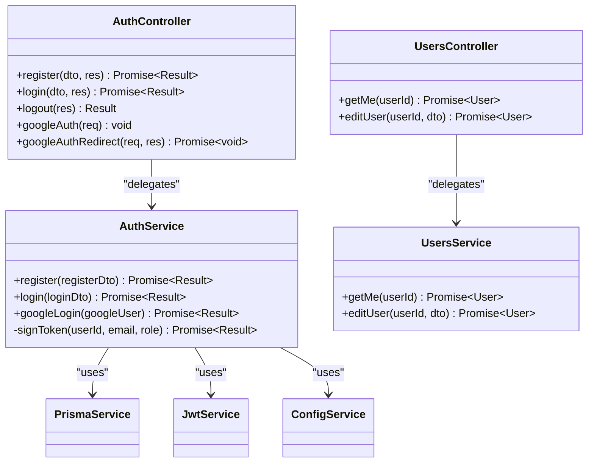
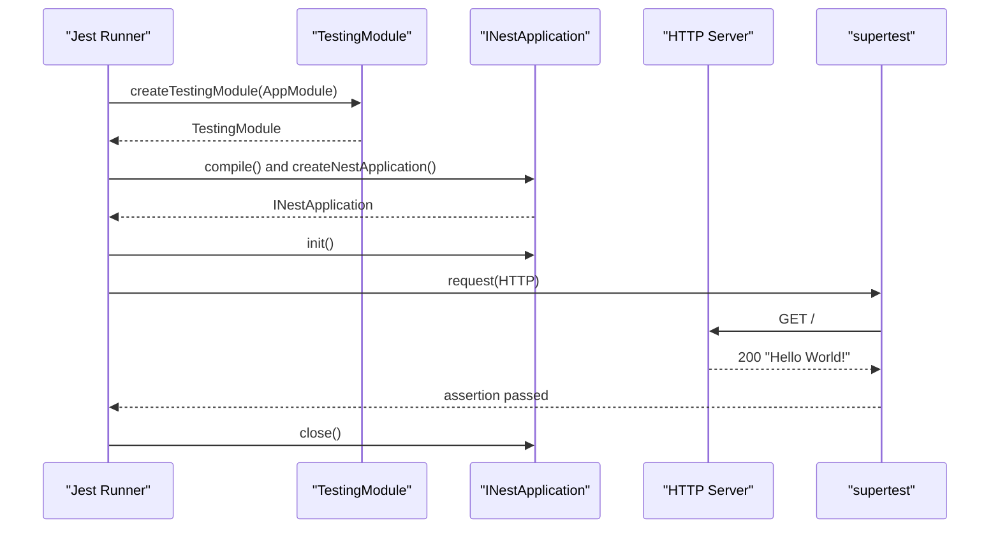
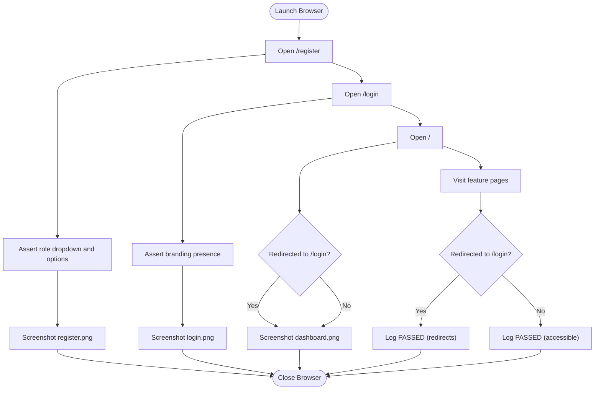
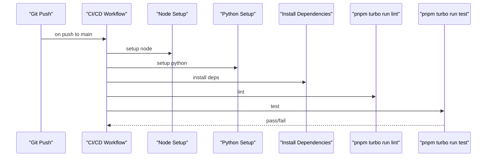
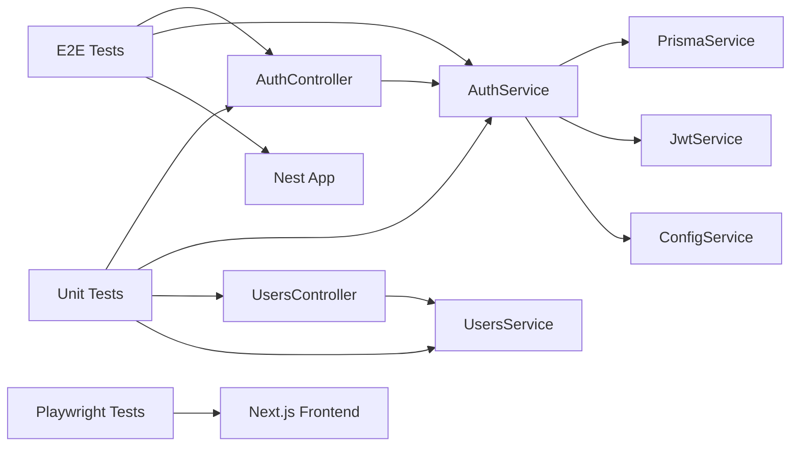

# Testing Strategy

<cite>
**Referenced Files in This Document**
- [ci-cd.yaml](file://.github/workflows/ci-cd.yaml)
- [jest-e2e.json](file://apps/api/test/jest-e2e.json)
- [app.e2e-spec.ts](file://apps/api/test/app.e2e-spec.ts)
- [app.controller.spec.ts](file://apps/api/src/app.controller.spec.ts)
- [auth.service.spec.ts](file://apps/api/src/modules/auth/auth.service.spec.ts)
- [auth.controller.spec.ts](file://apps/api/src/modules/auth/auth.controller.spec.ts)
- [users.service.spec.ts](file://apps/api/src/modules/users/users.service.spec.ts)
- [users.controller.spec.ts](file://apps/api/src/modules/users/users.controller.spec.ts)
- [package.json (API)](file://apps/api/package.json)
- [package.json (Web)](file://apps/web/package.json)
- [turbo.json](file://turbo.json)
- [pnpm-workspace.yaml](file://pnpm-workspace.yaml)
- [test-agrinexus.mjs](file://test-agrinexus.mjs)
- [eslint.config.mjs](file://apps/api/eslint.config.mjs)
</cite>

## Table of Contents
1. [Introduction](#introduction)
2. [Project Structure](#project-structure)
3. [Core Components](#core-components)
4. [Architecture Overview](#architecture-overview)
5. [Detailed Component Analysis](#detailed-component-analysis)
6. [Dependency Analysis](#dependency-analysis)
7. [Performance Considerations](#performance-considerations)
8. [Troubleshooting Guide](#troubleshooting-guide)
9. [Conclusion](#conclusion)
10. [Appendices](#appendices)

## Introduction
This document describes the testing strategy for the project, covering unit testing with Jest, integration testing, end-to-end testing, and automated test execution. It explains the testing architecture, test organization, mocking strategies, and test data management. It also provides guidelines for writing effective tests, continuous integration testing, and test automation workflows, along with the testing utilities and helper functions used across the codebase.

## Project Structure
The repository follows a monorepo layout managed by pnpm workspaces and Turborepo. Testing is organized per application:
- API application (NestJS) includes unit tests under src modules and e2e tests under apps/api/test.
- Web application (Next.js) is structured for UI testing with Playwright in a standalone script.

Key testing files and configuration:
- API unit tests use Jest with ts-jest transform and a root test regex targeting spec.ts files.
- API e2e tests use a dedicated jest-e2e.json configuration and supertest for HTTP assertions.
- CI/CD pipeline automates linting and testing on pushes to main.

**Diagram sources**
- [ci-cd.yaml:1-81](file://.github/workflows/ci-cd.yaml#L1-L81)
- [jest-e2e.json:1-10](file://apps/api/test/jest-e2e.json#L1-L10)
- [package.json (API):98-118](file://apps/api/package.json#L98-L118)
- [test-agrinexus.mjs:1-135](file://test-agrinexus.mjs#L1-L135)

**Section sources**
- [pnpm-workspace.yaml:1-4](file://pnpm-workspace.yaml#L1-L4)
- [turbo.json:1-22](file://turbo.json#L1-L22)
- [ci-cd.yaml:1-81](file://.github/workflows/ci-cd.yaml#L1-L81)
- [package.json (API):1-120](file://apps/api/package.json#L1-L120)
- [jest-e2e.json:1-10](file://apps/api/test/jest-e2e.json#L1-L10)
- [test-agrinexus.mjs:1-135](file://test-agrinexus.mjs#L1-L135)

## Core Components
- Unit tests for NestJS modules:
  - Services: AuthService, UsersService
  - Controllers: AppController, AuthController, UsersController
- E2E tests for the API using supertest against a compiled Nest application
- Playwright-based UI tests for the Next.js web app
- CI/CD pipeline invoking lint and test tasks via Turborepo

Mocking and test data patterns:
- Module-level mocking for argon2 hashing to avoid slow crypto operations
- Provider-level injection of mock services and libraries (PrismaService, JwtService, ConfigService)
- Factory helpers to construct DTOs and entity fixtures consistently across tests
- Suppressed ESLint rules for Jest globals in the API project

**Section sources**
- [app.controller.spec.ts:1-23](file://apps/api/src/app.controller.spec.ts#L1-L23)
- [auth.service.spec.ts:1-287](file://apps/api/src/modules/auth/auth.service.spec.ts#L1-L287)
- [auth.controller.spec.ts:1-165](file://apps/api/src/modules/auth/auth.controller.spec.ts#L1-L165)
- [users.service.spec.ts:1-117](file://apps/api/src/modules/users/users.service.spec.ts#L1-L117)
- [users.controller.spec.ts:1-93](file://apps/api/src/modules/users/users.controller.spec.ts#L1-L93)
- [app.e2e-spec.ts:1-30](file://apps/api/test/app.e2e-spec.ts#L1-L30)
- [eslint.config.mjs:1-35](file://apps/api/eslint.config.mjs#L1-L35)

## Architecture Overview
The testing architecture integrates multiple layers:
- Unit tests validate business logic in isolation using Jest and Nest TestingModule
- E2E tests validate HTTP endpoints and request/response flows using supertest against a bootstrapped Nest application
- UI tests validate user journeys using Playwright against the Next.js frontend
- CI/CD orchestrates linting and testing across the monorepo

**Diagram sources**
- [package.json (API):11-24](file://apps/api/package.json#L11-L24)
- [app.e2e-spec.ts:1-30](file://apps/api/test/app.e2e-spec.ts#L1-L30)
- [test-agrinexus.mjs:1-135](file://test-agrinexus.mjs#L1-L135)
- [ci-cd.yaml:1-81](file://.github/workflows/ci-cd.yaml#L1-L81)

## Detailed Component Analysis

### Unit Testing with Jest (NestJS Modules)
- Test organization:
  - Each module’s service and controller has a corresponding spec file under src/modules/<module>
  - Shared mocks and factories are defined at the top of service spec files
- Mocking strategies:
  - argon2 is mocked at the module level to replace slow hashing with deterministic stubs
  - PrismaService, JwtService, and ConfigService are injected via provide/useValue
  - Minimal mocks only for methods exercised by the tested function
- Test data management:
  - Factory functions produce consistent DTOs and entity fixtures
  - Overrides enable targeted scenarios without duplicating fixtures
- Assertions:
  - Verify interactions with mocks (call count, arguments)
  - Verify returned shapes and error propagation
  - Validate JWT payload composition and defaults

**Diagram sources**
- [auth.service.spec.ts:1-287](file://apps/api/src/modules/auth/auth.service.spec.ts#L1-L287)
- [auth.controller.spec.ts:1-165](file://apps/api/src/modules/auth/auth.controller.spec.ts#L1-L165)
- [users.service.spec.ts:1-117](file://apps/api/src/modules/users/users.service.spec.ts#L1-L117)
- [users.controller.spec.ts:1-93](file://apps/api/src/modules/users/users.controller.spec.ts#L1-L93)

**Section sources**
- [auth.service.spec.ts:1-287](file://apps/api/src/modules/auth/auth.service.spec.ts#L1-L287)
- [auth.controller.spec.ts:1-165](file://apps/api/src/modules/auth/auth.controller.spec.ts#L1-L165)
- [users.service.spec.ts:1-117](file://apps/api/src/modules/users/users.service.spec.ts#L1-L117)
- [users.controller.spec.ts:1-93](file://apps/api/src/modules/users/users.controller.spec.ts#L1-L93)

### Integration Testing (E2E)
- E2E configuration:
  - jest-e2e.json sets testRegex to match .e2e-spec.ts and transforms TypeScript via ts-jest
  - Test environment is Node with rootDir pointing to apps/api/test
- Test pattern:
  - Bootstrap TestingModule with AppModule
  - Initialize Nest application and use supertest to assert HTTP endpoints
  - Close application after each test to free resources

**Diagram sources**
- [app.e2e-spec.ts:1-30](file://apps/api/test/app.e2e-spec.ts#L1-L30)
- [jest-e2e.json:1-10](file://apps/api/test/jest-e2e.json#L1-L10)

**Section sources**
- [app.e2e-spec.ts:1-30](file://apps/api/test/app.e2e-spec.ts#L1-L30)
- [jest-e2e.json:1-10](file://apps/api/test/jest-e2e.json#L1-L10)

### End-to-End Testing (UI with Playwright)
- Playwright script validates:
  - Registration page elements and role options
  - Login page branding
  - Dashboard redirection behavior
  - Feature pages accessibility and redirects
- Screenshot capture and structured logging provide evidence of test outcomes
- Headless Chromium ensures reproducible CI execution

**Diagram sources**
- [test-agrinexus.mjs:1-135](file://test-agrinexus.mjs#L1-L135)

**Section sources**
- [test-agrinexus.mjs:1-135](file://test-agrinexus.mjs#L1-L135)

### Automated Test Execution and CI/CD
- CI/CD workflow:
  - Checks out the repository
  - Sets up pnpm, Node.js, uv, and Python
  - Installs dependencies for both Node and Python
  - Runs linter and tests via Turborepo
- Turborepo tasks:
  - Provides lint, build, check-types tasks with inter-task dependencies
  - No explicit test task is defined in turbo.json; tests are executed via app scripts
- Test commands:
  - API app exposes scripts for jest, watch mode, coverage, and e2e
  - Web app focuses on linting and type checking; UI tests are run via Playwright script

**Diagram sources**
- [ci-cd.yaml:1-81](file://.github/workflows/ci-cd.yaml#L1-L81)
- [turbo.json:1-22](file://turbo.json#L1-L22)
- [package.json (API):11-24](file://apps/api/package.json#L11-L24)
- [package.json (Web):6-11](file://apps/web/package.json#L6-L11)

**Section sources**
- [ci-cd.yaml:1-81](file://.github/workflows/ci-cd.yaml#L1-L81)
- [turbo.json:1-22](file://turbo.json#L1-L22)
- [package.json (API):11-24](file://apps/api/package.json#L11-L24)
- [package.json (Web):6-11](file://apps/web/package.json#L6-L11)

## Dependency Analysis
- Internal dependencies:
  - AuthController depends on AuthService
  - UsersController depends on UsersService
  - Services depend on PrismaService, JwtService, and ConfigService
- External dependencies:
  - argon2 is mocked in unit tests to avoid slow hashing
  - supertest is used for API e2e assertions
  - Playwright is used for UI e2e assertions
- Workspace and toolchain:
  - pnpm workspaces define package locations
  - Turborepo orchestrates cross-app tasks

**Diagram sources**
- [auth.controller.spec.ts:1-165](file://apps/api/src/modules/auth/auth.controller.spec.ts#L1-L165)
- [auth.service.spec.ts:1-287](file://apps/api/src/modules/auth/auth.service.spec.ts#L1-L287)
- [users.controller.spec.ts:1-93](file://apps/api/src/modules/users/users.controller.spec.ts#L1-L93)
- [users.service.spec.ts:1-117](file://apps/api/src/modules/users/users.service.spec.ts#L1-L117)
- [app.e2e-spec.ts:1-30](file://apps/api/test/app.e2e-spec.ts#L1-L30)
- [test-agrinexus.mjs:1-135](file://test-agrinexus.mjs#L1-L135)

**Section sources**
- [auth.controller.spec.ts:1-165](file://apps/api/src/modules/auth/auth.controller.spec.ts#L1-L165)
- [auth.service.spec.ts:1-287](file://apps/api/src/modules/auth/auth.service.spec.ts#L1-L287)
- [users.controller.spec.ts:1-93](file://apps/api/src/modules/users/users.controller.spec.ts#L1-L93)
- [users.service.spec.ts:1-117](file://apps/api/src/modules/users/users.service.spec.ts#L1-L117)
- [app.e2e-spec.ts:1-30](file://apps/api/test/app.e2e-spec.ts#L1-L30)
- [test-agrinexus.mjs:1-135](file://test-agrinexus.mjs#L1-L135)

## Performance Considerations
- Fast unit tests:
  - argon2 is mocked to eliminate slow cryptographic hashing during tests
  - Minimal provider mocks reduce external I/O overhead
- Coverage and speed:
  - Jest coverage collection enabled in API app config
  - Watch mode and debug scripts support rapid iteration
- E2E performance:
  - supertest avoids browser overhead for backend e2e tests
  - Playwright headless mode reduces resource usage in CI

[No sources needed since this section provides general guidance]

## Troubleshooting Guide
Common issues and resolutions:
- Missing Jest globals in ESLint:
  - API project enables Jest globals in eslint.config.mjs to avoid lint errors in spec files
- Slow tests due to hashing:
  - argon2 is mocked globally in service specs; ensure jest.clearAllMocks() is called in beforeEach to reset state
- E2E teardown:
  - Ensure app.close() is called after each e2e test to prevent port conflicts
- Mock drift:
  - Keep mock shapes aligned with actual service signatures; use factory helpers to maintain consistency
- CI failures:
  - Verify pnpm lockfile integrity and Python dependencies installation steps in the workflow

**Section sources**
- [eslint.config.mjs:1-35](file://apps/api/eslint.config.mjs#L1-L35)
- [auth.service.spec.ts:74-91](file://apps/api/src/modules/auth/auth.service.spec.ts#L74-L91)
- [app.e2e-spec.ts:26-28](file://apps/api/test/app.e2e-spec.ts#L26-L28)

## Conclusion
The project employs a layered testing strategy:
- Unit tests isolate business logic with precise mocks and factories
- E2E tests validate HTTP endpoints using supertest against a bootstrapped Nest application
- UI tests validate user journeys using Playwright against the Next.js frontend
- CI/CD automates linting and testing across the monorepo

Adhering to the documented patterns and guidelines will help maintain reliable, fast, and maintainable tests.

[No sources needed since this section summarizes without analyzing specific files]

## Appendices

### Writing Effective Tests
- Prefer small, focused tests that assert a single behavior
- Use factory helpers to construct DTOs and entities
- Mock only what is necessary; favor minimal provider mocks
- Verify both behavior and interactions (e.g., JWT payload composition)
- Keep beforeEach blocks consistent and reset mocks between tests

[No sources needed since this section provides general guidance]

### Test Utilities and Helpers
- Mock factories:
  - Service specs define factories for DTOs and entities
- Argument matchers:
  - Use expect.objectContaining to assert partial argument shapes
- Cookie assertions:
  - Controller specs validate httpOnly cookies and redirect targets
- E2E helpers:
  - supertest for HTTP assertions in e2e tests

**Section sources**
- [auth.service.spec.ts:47-68](file://apps/api/src/modules/auth/auth.service.spec.ts#L47-L68)
- [auth.controller.spec.ts:5-14](file://apps/api/src/modules/auth/auth.controller.spec.ts#L5-L14)
- [app.e2e-spec.ts:19-23](file://apps/api/test/app.e2e-spec.ts#L19-L23)